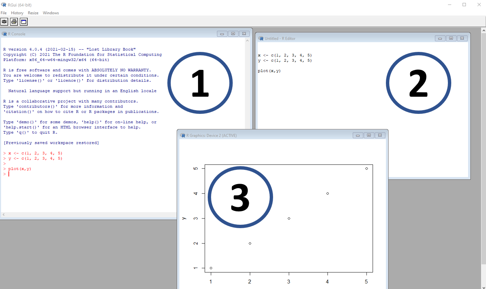
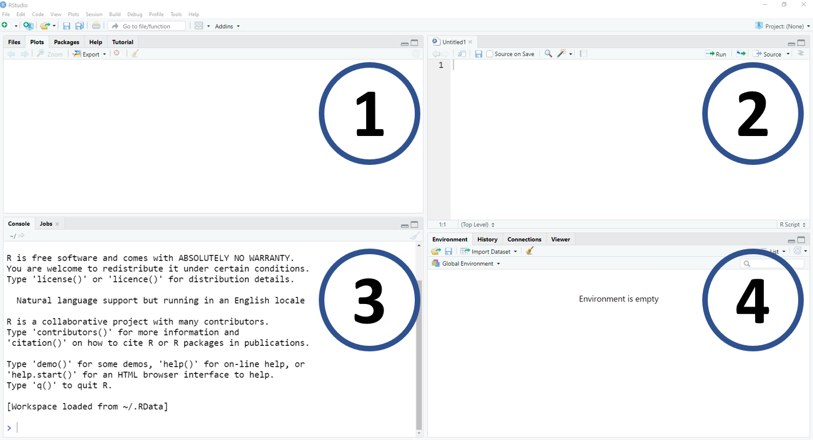
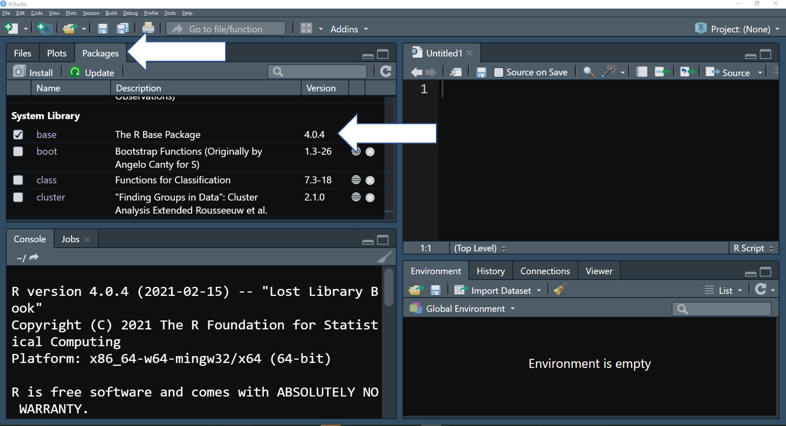
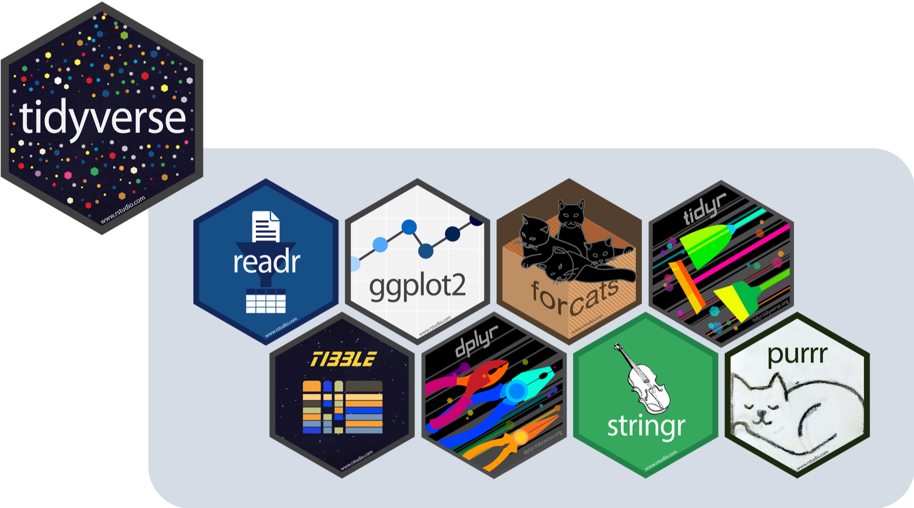
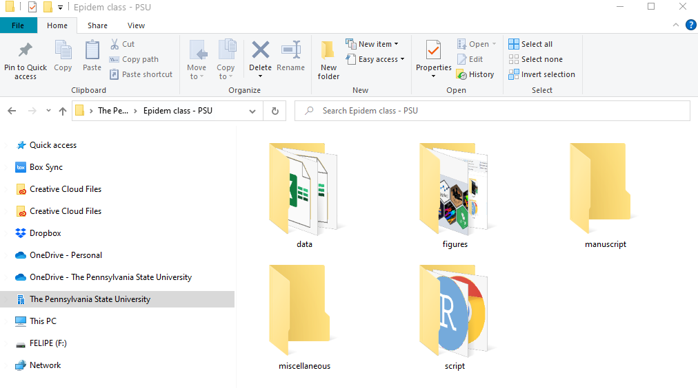
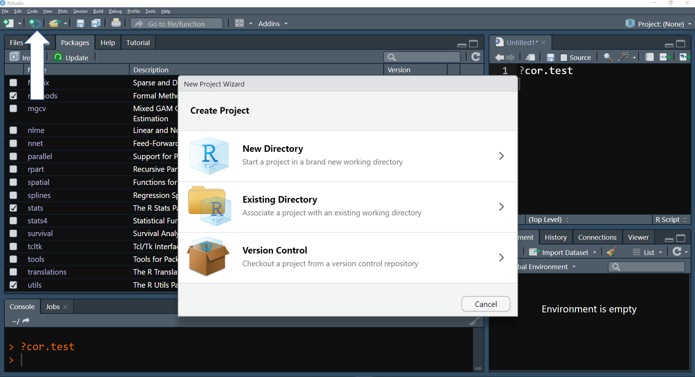
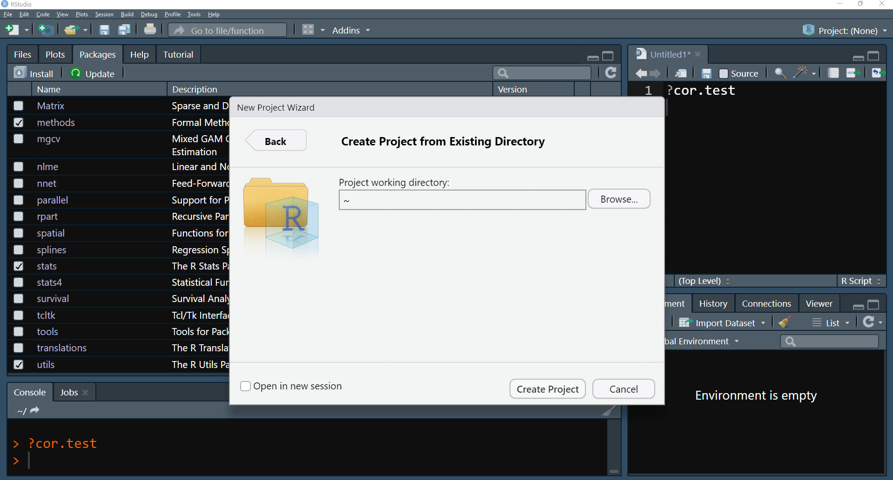

# **Introduction**

R is an open source language developed by Ross Ihaka and Robert Gentleman, and is based on S, an earlier programming language used for statistical computing. [(source)](https://www.r-project.org/about.html). Today R is one of the most popular tools used in data analysis and statistics.

This class will cover a basic introduction to R. Our goals are to provide a resource for learning to use R for plant epidemiology research. In the intro, we provide an explanation of basic, but important R tools and functions to give learners the background they need for the rest of the material. Please note that additional tools and functions will also be introduced as the course progress.

There are plenty of free, online resources available. Below are a few recommendations:

-   [R for Data Science](https://r4ds.had.co.nz/) by Hadley Wickham and Garrett Grolemund
-   [Advanced R](https://adv-r.hadley.nz/) by Hadley Wickham
-   [RStudio Cheatsheets](https://www.rstudio.com/resources/cheatsheets/) by RStudio
-   [Intro to R](https://everhartlab.github.io/APS_IntroR_2020/refs.html) by Dr. Sydney E. Everhart, Nikita Gambhir, Dr. Kaitlin Gold, Dr. Lucky Mehra, and Dr. Zhian N. Kamvar.
-   [Modeling tools and techniques using R](https://rtools.netlify.app/) by Paul Esker and Felipe Dalla Lana, with contributions from Neil McRoberts and Julie Baniszewski

<br>

> **Remember**, R is a software language, and just like learning a foreign language, it requires time and committment to learn. Once you have learned some of the basics, you will be able to continue adding new "words" and capabilities to your vocabulary and continue to build a mastery of R.

# **R and RStudio**

**R** is freely available to download [here](https://www.r-project.org/) from the R Foundation. R is supported by Windows, Linux, and Mac.

```{r,echo=FALSE, out.width='90%', fig.align='center', fig.cap='Figure, R. A screenshot of the R GUI interface: (1) is the console, where codes are entered and read by the software; (2) is the script or code source, where the user enters information that can be copied and pasted into the console; and (3) is a window with graph output.'}

```

<br>

Users typically interact with R through RStudio, an IDE (integrated development environment). RStudio is a user-friendly software used to make it easier for people to use R. It can be reliably downloaded here [RStudio](https://www.rstudio.com/). The software is highly customized and includes many additional plugins(add-on pieces of code that provide additional functions). 

```{r,echo=FALSE, out.width='90%', fig.align='center', fig.cap='Figure, IDE-RStudio. A screenshot of RStudio: (1) is a window with multiple pieces of information, for example, files, plots, packages, and help tools; (2) is the location of the source or script; (3) is the R console; (4) is a window with  objects, coding history and more'}

```

# **The basics**

R can be used as a simple calculator:

```{r echo=TRUE}
# Addition:
2+2

# Subtraction:
10-5

# Multiplication:
15*2

# Division:
20/10

# Exponents:
3^3 # or 3**3

# Division to result in a whole number:
10%/%3

# Returning the remainder from the above operation: 
10%%3


```

<br>

There are many more calculations that can be performed with functions. A function is a piece of code that performs a certain task on data provided, and typically returns some result. 

There are many more mathematical calculations and manipulations you can accomplish with functions from base R: 

```{r}
# Mean:
mean(c(4,10))

# Standard deviation:
sd(c(2,2,4,4,2,2))

# Square root:
sqrt(9)

# Natural log:
log(100)

# Using log and defining the base (here base of 10):
log(100, base = 10)

# Exponentials:
exp(5)

# Absolute value 
abs(-7)
```

<br>

## **Objects**

All data in R is considered an 'object'. Objects can mean a singular value, such as a number, or it can be a collection of values. You'll learn more about different kinds or 'classes' of objects in the next section.

Objects need to be assigned names to be used. To do this, use the `<-` or `=` signs. Typically, the arrow `<-` is preferred since it does avoid errors in very [specific situations](https://stackoverflow.com/a/51564252/7711459). There are keyboard shortcuts for <-. With Windows, press 'Alt' and '-' # simultaneously (ex. Alt + -). With Mac, press 'Option' and '-' (ex. Option + -).

```{r , error=TRUE}

# You can use = to assign a value:
a = 2 
a

# You can also use <- to assign a value:
b <- 10 
b

# You can use the assigned objects to do calculations:
c <- a+b
c

# An object can also be a character string (a series of letters or numbers), or even multiple character strings! 
d <- "R is fun"
d
e <- c("R is fun","So is plant pathology!")
e

# Objects can contain multiple numbers:
f <- c(1,2,3,4,5) # the c means concatenate 
f

# Objects and numbers can be grouped into a table (more on this later):
g <- data.frame(First = c(1,2,3,4,5),
                Second = c("A", "B", "C", "D", "E"))
g

```

<br>

Although you can give almost any name for an object in R, there are some words that **cannot** be used and others that should be *avoided*.

```{r , error=TRUE}

# You cannot use ONLY a number as object name:
1 <- 2
a1 <- 2

# Some words are reserved for specific functions and cannot be used:
NA <- 200
NaN <- 150
TRUE <-100
FALSE <- 50
Inf <- 0

# Other keywords that cannot be used as object name include:
# "break", "else", "for", "if", "next", "repeat", "return", and "while".

# You also cannot use specific keyboard symbols, such as /, @, %, !, etc.:
UCR/fito <- 100

UCR@fito <- 100

UCR%fito <- 100


```

<br>

It is good practice to label your objects in an intuitive and descriptive manner, and to follow similar patterns.

For example, if you have multiple objects such as monthly temperature reports, it would be considered preferable to use something like:`temp_jan`, `temp_feb`, `temp_mar`, etc. These names are very intuitive and descriptive, and follow the same pattern (variable, underline separation, month with 3 characters), and will be quickly understandable for someone with some familiarity of the data.

On the other hand, using names such as `var1`, `col1`, `Object 1`, make it very difficult for someone to understand the coding without additional information, or for you to understand your own code after a break. Avoid changing the name separation (e.g.`temp_jan`, `temp.feb`) and take extra care with the use of capitalization (upper and lower case letters), since R is case-sensitive and this can often lead to errors in your code or difficulties in running specific analyses. For example, `temp_Jan` and `Temp_Feb` both work, but may add an additional layer of coding complexity that is not necessary.

<br>

When possible, we also recommend avoiding giving names to objects that are also used as functions (more about functions below).

```{r}
# The mean() function calculates the mean of a set of values or of a numeric object:
mean(c(1, 2, 3, 4, 5))

# If you also use 'mean' as an object name, you and others may get confused, and depending on the circumstances, you may get a weird result:
mean <- c(1, 2, 3, 4, 5)
mean(mean)


```

<br>

We can give names to plots (data visualization will be covered in the next section) and many other data formats (data frames, matrix, vector, list, etc). This allows us to reference these plots and other objects in future manipulations.

```{r}
# We will learn how to create better plots later, but just for example:
# Load ggplot2, a package that is useful for making high-quality plots:
library(ggplot2)

# Assign some arbitrary data to object 'data_plot':
data_for_plot = data.frame(x=c(1,2,3,4,5,6), y=c(1,2,3,4,5,6))

# Create the data object 'plot_name' with instructions on how to build a plot:
plot_name = ggplot(data_for_plot, aes(x = x, y=y)) + geom_point() 

# Now that our plot has a name, we can easily view it:
plot_name

# By using our plot's name (plot_name), we can save our plot or add other features to it without re-creating it. 

# Save our plot:
ggsave("our_plot.png", plot=plot_name, device="png")

# Add more aesthetic detail to our plot:
plot_name + geom_point(aes(colour=x))
```

<br>

# **Data types and structure**

## **Types of data**

From a practical point of view, the most important data types/classes are:

-   **Numeric** = values that can be specified at the decimal level, for example `1.2`, `3.141593`, `10.0`, and `-5.2`
-   **Integer** = values similar to numeric, but they cannot be defined at the decimal level. Examples of integer are `1`, `2`, `-4`, an `500`
-   **Logical** = values that can only be defined as `TRUE` or `FALSE`, or `T` and `F` for short
-   **Character** = words that are like elements that are surrounded by " or ', such as `"PA"`, `"Costa Rica"`, `"soybean"`. But, these can also refer to other numbers (`"1.2"`, `'10'`, `'-15'`), or logical values (`"TRUE"`, `"FALSE"`)
-   **Factor** = categorical variables that contains predefined elements. Factors have levels, which determine the order of its elements. See below for examples.
-   **Date** = elements in data format, they can be at day level (*date*) or date and time, including hours, minute, second, and sub-second elements (*POSIXct*). See below for examples.

Some values, such as numbers, can be coerced to a numeric data class from a character data class and vice versa with functions like `as.numeric()` and `as.character()`.

*NOTE*: For practical purposes, we simplified these types of data as part of the introduction. In R, these are called atomic vectors. There are also two other types of atomic vectors which are rarely used and will not be mentioned here (`complex` and `raw`). If you would like to explore this in more detail, we recommend Chapter 3 and 13 of Wickham book, [Advanced R](https://adv-r.hadley.nz/vectors-chap.html).

### **Numeric**

```{r}
# Let's create an example of a group of numeric values: 
numeric_example <- c(1.2, 1.5, 3.14, 2.7182)

# You can directly ask if object 'numeric_example' is numeric with the is.numeric() function:
is.numeric(numeric_example)

# Or determine the data class of the object with the class() function:
class(numeric_example)

```

### **Integer**

```{r}

# Let's start by creating a vector of numbers:
integer_example <- c(1,5,7,-4)

# See if the new vector is an integer-class data type:
is.integer(integer_example)

# If is not integer, what is the class type?
class(integer_example) 

# When you information as numbers, R will assume that is numeric.
# We have to inform R that that the values are integers by using the function as.integer()
integer_exemple <- as.integer(c(1,5,7,-4))
is.integer(integer_exemple)
class(integer_exemple) 

# Now, if you enter information that has decimals and force the result to be an integer,
# R will ignore the decimal information 
as.integer(c(3.1, 4.9, 5.499999, 9.99999))

# If you enter information as words (= class, character) and try to force this to be an integer
# R will return an error
as.integer(c("Sunday", "Monday", "Tuesday", "Wednesday"))

# If you enter numerical values in character format, it works because numbers can be character values
number_character <- c("1", "2", "3")
class(number_character)

as.integer(number_character)
class(as.integer(number_character))

# This type of transformation is very useful for some data loading in R where the values can be considered as characters

```

### **Logical**

```{r}

# As mentioned earlier, logical values can be only be considered as TRUE or FALSE:
logical_example <- c(TRUE, FALSE, T, F)
is.logical(logical_example)

# Logical operations are very important for situations where you want to check specific conditions.
# For example, if one number is greater than then other:
5 > 10        # five is greater than 10?

# Also, if character strings are "equal" or identical:
"Sunday" == "Monday"  # Sunday is equal to Monday?
identical("Sunday","Monday")

# You can also check that character strings are not 'equal' or identical:
"Sunday" != "Tuesday" # Sunday is different to Tuesday?


# Here is an example where R interprets that the character "2" should actually be numeric, allowing the logical statement to be interpreted as TRUE:
1 < "2"


```

### **Character**

```{r , error=TRUE}

# Character values are basic word elements (including numbers) or phrases:
character_example <- c("banana", 'epidemiology', "TRUE", "11", "A character can be more than a single word")
is.character(character_example)

# Character values can be defined using either quotation marks ("") or apostrophes (''):
character_example

# But if you forget to include the " or ', R will give you an error message because R thinks that it is an object!
# Compare: 
character_example <- c("banana", epidemiology)
# vs.
character_example <- c("banana", "epidemiology")

```

### **Factor**

```{r}

# Factors are ordinal, in contrast to character values. This means they have a defined order or level.  
factor_example <- as.factor(c("red", 'blue', "green", "red", "red"))
class(factor_example)

# Our example has an order and has levels. In this case, the 'order' matches the sequence in which the values were introduced above. R automatically sets the 'levels' by alphabetical order.
factor_example

# A useful function is factor(). With factor(), you can define the order, level, and other attributes. For example, you can change the levels from alphabetical order 'blue','green','red' to any other configuration:
factor_example2 <- factor(c("red", 'blue', "green", "red", "red"), levels = c("red", "blue", "green"))
factor_example2

# You can also change the name of the elements by changing the level label
factor_example3 <- factor(c("red", 'blue', "green", "red", "red", "yellow"), 
                          levels = c("red", "blue", "green", "yellow"), 
                          labels = c("RED", "Blue", "green", "green"))
factor_example3

# The result from us adding a new color, yellow, is that we redefined what 'yellow' means. # In this case, 'yellow' now results in green. We also changed the format for 'red' and 'blue' to include upper-case letters.   
```
<br>

Tip: The order and levels of a factor-class object can dictate the order in which later functions are applied and how resulting plots are formatted.

### **Date**

```{r}

# The most common date format is POSIX (Portible Operating System Interface). 
# POSIX describes the date and time, to the millisecond in a string format:
as.POSIXct("2021-04-25 11:30:45")

# You can use different time zones and date formats by defining format and tz parameters. # In the example above, we write the date as year-month-date. We can easily convert other # date formats and define time zone with the as.POSIXct() function, as shown in the next example.

# The date in New Zealand may be written as day/month-year. We tell the as.POSIXct() function to expect this format by typing format = "%d/%m-%Y. We also tell the as.POSIXct() function that the time zone is in New Zealand with tz = "NZ". If the tz parameter is not defined, R assumes the time zone.

as.POSIXct("25/04-2021 14:30:45", 
           format = "%d/%m-%Y %H:%M:%OS", 
           tz = "NZ")

# If the tz parameter is not defined, R assumes the time zone.
# Also, note that we used /(slash) instead of - (dash). This is to demonstrate that R can deal with date information in many different formats that data may come in.
# This means that we can use different formats, and as.POSIXct() function still will print information using the default POSIX format.

# There are two functions which we can use: as.POSIXct() and as.POSIXlt(), which create 
# different classes of dates and times. 
ct <- as.POSIXct("2021-04-05 11:30:45")
lt <- as.POSIXlt("2021-04-05 11:30:45")

class(ct)
class(lt)

# Although they are technically different classes of objects, both outputs look the same:
ct
lt

# The difference between these two classes are in their internal components. Internally, ct retains the number of seconds since 1970-01-01 and is generally preferable for use in data sets. lt retains the # full date and time in it's format, and is generally more readable to humans. 
unclass(ct) # The big number is the total of seconds since 1970-01-01
unclass(lt)

# Despite the difference in internal structure, it is possible to extract specific information, for example, year, month, day, etc. from both. 
weekdays(ct)
months(lt)
quarters(ct)

# Another function and class we can use for date information is as.Date(), which 
# produces a Date object.
dt <- as.Date("2021-04-25 11:30:45")
dt
class(dt)

# As you can see, they are similar to POSIX functions. However, they include only the specified information. For example, if you only provide the date, only the date will be stored. This is in contrast to the as.POSIX() functions, which will infer and store a time zone. 
dt <- as.Date("2021-04-25")
dt
ct <- as.POSIXct("2021-04-25")
ct
 
```

## **Data structure**

Now that we understand the most important types of data, we can learn about how these types of data can be grouped for analyses. R is quite flexible in terms of grouping data. There are basically six different data structures in R:

-   **Scalar** = a one element data structure. Scalars can contain a single instance of a data type value. Many data types are acceptable. 
    ex. `x <- 2`; `y <- "beans"`; b = x > y
-   **Vector** = a one-dimensional data structure composed of multiple scalars from the same data type (numeric, integer, logical, etc.,).
    ex. z <- c("beans","corn","wheat")
    ex. a <- c(2,4,8,16)
-   **Matrix** = a two-dimensional data structure that contains multiple vectors from the same type/mode
-   **Array** = a three-dimensional data structure that contains only data from the same data type (character, numeric, etc.,). It is similar to a matrix except that it has three dimensions rather than two. It can help to think of arrays as being constructed of layers of different matrices. 
-   **Data frame** = are two-dimensional data, similar to matrices. The difference is that data frames can hold vectors from *different* types of data (character & numeric, etc.,). 
-   **List** = are the most complex data structures in R. They can hold a collection of objects and other data structure types, ranging from something as simple as a one element scalar to more complex things such as arrays or plots.

The figure below illustrates the differences between these five data structure types:

```{r,echo=FALSE, out.width='85%', fig.align='center', fig.cap='Types of data structure in R. [Imagen source](http://venus.ifca.unican.es/Rintro/dataStruct.html#data-structure-types)'}
knitr::include_graphics("figures/intro_r/data_structure.png")
```


### **Vector**

```{r}

# You can use the function c(), which means concatenate, to create vectors
x <- c(1, 2, 3, 4)
y <- c("a", "b", "c", "d")

x
y

# You can select an element within a vector using square brackets [].
y[3] # This will extract and provide the third element in vector y.
```

### **Matrix**

```{r }

# Here's an example of a matrix containing numbers 1 to 12. With 'ncol' and 'nrow' arguments, we construct a matrix with 3 columns and 4 rows: 
matrix_a <- matrix(1:12,ncol=3,nrow=4)
matrix_a

# To extract elements from a matrix, you have to specify first the row and then the column: 
matrix_a[2,3]

# If we don't know how big a matrix is, we can see its dimensions using the dim() function:
dim(matrix_a)

# Names can be added to rows and columns by using the option 'dimnames':
matrix(1:12,nrow=4,ncol=3 ,
       dimnames = list(c("A", "B", "C", "D"),
                       c("X", "Y", "Z")))

```

### **Array**

```{r}

# Arrays can be constructed with the 'dim' argument specifying the number of rows, columns, and matrices. 
array_a <- array(1:36,dim=c(3,4,3)) # 3 matrices with 3 rows and 4 columns each.
array_a 

# Note that the array is presented as multiple matrices, allowing us to see all of its values. 

# You can also add row, column, and matrix names with the 'dimnames' argument.
array_a =  array(1:36,dim=c(4,3,3), 
                 dimnames = list(c("A", "B", "C", "D"),
                                 c("X", "Y", "Z"),
                                 c("First", "Second", "Third")))


# Similar to vectors and matrices, you can extract elements by using [ ] (brackets)
array_a[2,1,2] # This is the value at row 2, column 1, of matrix layer 2.
array_a[1,1,1] # This is the value at row 1, column 1, of matrix layer 1.

# If you do not indicate one or more of the values, R will collect for all of the other dimensions not specified
array_a[,1,] # This extracts the first column from all matrices in the array. 
array_a[1,1,] # This extracts the value in row 1, column 1 of all 3 matrices in array_a. 

```

# Tip: Don't forget the commas, even when one or more values are not given. You'll get an error message!

### **Data frame**

Data frames can have vectors of different data types. This means that data frames can consist of a column of character values, a column of numeric values, and a column of logical data values, all in one data structure. 
```{r}

# Here we construct a numeric vector, a character vector, and a logical vector.
vec_numer <- c(1,2,3,4,5)
vec_char <- c("A", "B", "C", "D", "E")
vec_logic <- c(T, F, T, F, T)

# We use the data.frame() function to group our vectors together in a data frame.
df <- data.frame(vec_numer, vec_char, vec_logic)
df

# The str function will show the class of the vectors composing the data frame. 
str(df)

# To select an column in data.frame you can use $ symbol. 
df$vec_char

# Just like in other data structures, we can use the square brackets [] to extract values in specific rows and columns.
df[2,2] # This is the value in row 2, column 2 of the data frame.

```

### **List**

A list is the most complex type of data structure. Lists can hold all the other data structures in a single list object.
```{r}

# Here we construct a scalar, numeric vector, matrix, array, and data frame containing both numeric and character values and store them all in a list:
a <- 2
b <- c(1,2,3,4,5)
c <- matrix(1:20,4,5)
d <- array(1:40, c(4,5,2))
e <- data.frame(numbers = c(1:5),
                characters = LETTERS[1:5])

first_list <- list(a, b, c, d, e)
first_list

# We can inspect the composition of the list with str(), just like we can with data frames: 
str(first_list)

# You can add names to each data structure:
second_list <- list(scalar = a, vector = b, matrix = c, array = d, data_frame = e)
second_list

# A list can include another list:
third_list <- list(scalar = a, vector = b,  data_frame = e, my_list = second_list)
third_list

# Using [] (brackets), we can extract different components/elements from within the list
third_list[[3]] # Extract the 3rd component/element, data frame 'e'. 
third_list[[3]][2] # Extract the 2nd column (characters) of the 3rd element (data frame 'e').
third_list[[3]][1,2] # Extract the value in the 1st row and the 2nd column of the 3rd element. 

```

# **Functions**

## **Understanding functions**

Functions are one of core components of the R language. They help to make data analyses easier, especially when trying to automate some processes.

Let's start with a simple example of defining our own function `FUN_weather()`:

```{r}

FUN_weather <- function(x){
  daily_weather = paste0("Today the weather is ", x)

  print(daily_weather) 
}

FUN_weather("good")

FUN_weather("rainy")

FUN_weather("hot!!!")
```

We can divide our functions into three components: *name*, *arguments*, and *body*.

-   The **Name** of your function is how it is called to be used. In the example above, we created a  function called `FUN_weather()`. As always, we recommend that you use names that are intuitive and follow some pattern. In FUN_weather, we used FUN to indicate that we have created a function (or functions). The part that says *weather* indicates that the function will have something to do with weather.
-   **Arguments** is where we list our inputs. We start with a call to the function: `FUN_weather()` and include all arguments inside the parentheses. In our example, we have only one input, `x`, although it is often very common to have multiple inputs.
-   The **Body** is where your arguments will be used. It includes the code within the curly brackets that is used when we created `FUN_weather()`. Often, you will not see the full body of functions unless you either create them or tweak how an already-existing function works. The body is where you tell your function what you want it to do. You can create objects within the body of the function (like 'daily_weather') and perform operations on that object, including printing it like we did above. R will process the entire body of the function, from the first line to the last, with the last line dictating the resulting output from the function. In this example, the output is "Today the weather is good" when the input is "good". 


*NOTE*: There is one more component in the operation of a function: the *environment*. For the majority of the cases you don't need to use it (\~99.9% of the cases), so we will not cover this part here. But if you want to learn more, we recommend you consult Hadley Wickham's book, [Advanced R](https://adv-r.hadley.nz/functions.html).

## **Adding more arguments**

In the next example, the function was constructed to decide if is a good day to go outside. For this function we use multiple arguments to make the decision. There are a lot of new things in the code, but for now let's focus on the function itself. To be able to go outside, three conditions must be met: (i) the temperature must be equal to or greater than 22C (variable X); (ii) the day must be sunny (y); and (iii) you cannot be busy, meaning you have the time to go outside (z). The function `ifelse()`, inside of `FUN_go_out()` will return "YES" if all conditions are meet, and "NO" otherwise. This information is saved in the object called `cond`. Depending on the result, this information will be pasted in the resulting outcome with function `paste0()`.

```{r}

# Here we create the function 'FUN_go_out'. This function will tell us if it's a good idea to go outside based on temperature (x), rain (y), and whether you are busy or not (z). 
FUN_go_out <- function(x = 15, y = "rain", z = "busy"){
 cond <-  ifelse(x >=  22 &
         y == "sunny" &
         z == "not_busy", 
         "YES", "NO")
  
  output<- paste0("Is it a good day to go out? ", cond)
  print(output)
}

# We can use the function we've created above by calling the function and giving it the inputs '15','rain', and 'busy': 
FUN_go_out(15,"rain","busy")

```

Another difference from the first function, 'FUN_weather()', is the use of pre-defined values for the arguments (x=15, y="rain", z="busy"). This means, that, unless otherwise specified, the values will always take the form of `x = 15`, `y = "rain"`, and `z = "busy"`. Now, let's see what happen if we run the function without changing any of the arguments (i.e., the default).

```{r}
# Here we run the function without changing any pre-defined values:
FUN_go_out()

```

In this case, R used the argument values that define the function. Since none of the criteria were met, the function output shows that it is not a good day to go out.

What if we change the parameters x, y, and z? What occurs now?

```{r}

FUN_go_out(x = 25, y = "sunny", z = "not_busy")

```

We get a different answer: it is a good day to go outside. 

We can also run the same example with less typing. When using functions, you do not always need to use a label for each argument (in this case, x=25, y="sunny", and z="not_busy"). R will assume that the inputs are in the same order used when defining the function (temperature, rain/no rain, busy/not busy).

```{r}

FUN_go_out(25, "sunny", "not_busy")

```

When an argument/input is missing, R will supply the default argument in place of the missing value. 

```{r}
# In this example, we do not define z as "busy" or "not_busy". R will use the default value (z="busy") that is used in the function's definition. 
FUN_go_out(x = 25, "sunny")

# The above line of code will produce the same result as if we had written:
FUN_go_out(x=25,"sunny","busy")

```

You can enter the arguments/inputs in a different order as long as they are properly labeled. However, this is not recommended because it increases the potential of making a mistake. 

```{r}
# In this example, R knows which order x, y, and z should go in and is able to complete the computation:
FUN_go_out(z = "not_busy", x = 25, y = "sunny")

# In this example, the arguments are not labeled. As a result, R does not know where to use each value. 
FUN_go_out("not_busy",25,"sunny")

```

The result is that R will tell you that it is NOT a good day to outside, although all of our conditions for going outside are met (temp>22, no rain, and not busy).

<br>

So far, the examples that we have shown are very simple. As we move into more complex methods, like linear regression or machine learning algorithms, we will have to increase the complexity of our functions. Many of the functions we will use as we progress have already been developed by others. You will still have the opportunity to improve your own skills of function development by understanding how many of these functions work and can be modified. 

Now that we understand the different data types, data structures, and the basic form and use of functions, we can transition to learning about **packages** in the next section. 

# **Packages**

## **What is a package?**

Formally, packages constitute the fundamental unit of what we define as "shareable code" ([Wickham 2015 - R Packages](https://r-pkgs.org/intro.html)). It is basically the easiest way to share a collection of custom functions and other elements (such as data and documentation) between multiple users. By default, R comes with several packages installed, such as, `base` and `graphics`, but there are thousands of other packages developed by people from different backgrounds, including plant pathologists, and many of these packages were developed to help solve a wide range of problems.

More simply put, packages add more function and features to base R. An example of a popular package is [ggplot2](https://cran.r-project.org/web/packages/ggplot2/ggplot2.pdf, which includes many features and functions that improve your ability to create high-quality custom graphics.

The packages available during any session in R can be viewed in the 'Packages' tab of the 'Files','Plots','Packages',etc. pane as seen below. 

```{r,echo=FALSE, out.width='100%', fig.align='center', fig.cap='In RStudio, you can find what packages are installed in the tap "Packages". Package name, a brief description, and version are showed'}

```

# **Installing/loading packages**

The most common way to install a package is through CRAN ([**C**omprehensive **R** **A**rchive **N**etwork])(https://cran.r-project.org/). CRAN is a networked repository of packages.

Let's illustrate installing and loading a package with the next example, where we install and load a package with many statistical functions named vegan. 

```{r eval=FALSE, include=TRUE}

# We used function 'install.packages' to securely download package 'vegan' from CRAN. The code for this package will be stored on your computer. 
install.packages("psych")

# Now that package is stored on your computer, we use the 'library' function to make the package available in our R session:
library(psych) # load the package

# We can also use the function 'require' to accomplish this same task: 
require(psych)


```

<br>

Note: # The difference between `library()` and `require()` is that `library()` will stop executing the code if there is an error. `require()` will not. Typically, it is best practice for beginners to use `library()` over `require()`. You can learn more about this from [Statology](https://www.statology.org/r-require-vs-library/#:~:text=The%20require()%20and%20library,the%20execution%20of%20the%20code.)

<br>

# **Resolving conflicts between packages**

Developers *try* to avoid using functions with similar names, but they do not always succeed. It is common that two different packages have functions with the same name. There are several ways to avoid these conflicts with the most common method being to dictate which package to use with 'packagename::function()'. This is illustrated in the next example where function 't()' is defined by base R and by a user-created function.

```{r}

# Here we create an example matrix to perform functions 't' on:
matrix_1 <- matrix(1:9, 3,3)
matrix_1

# Now, let us transpose this matrix (switch columns to rows and vice versa), using the function t() from base R, which is already installed and loaded:
t(matrix_1)

# So far, so good! But now if we create a function called 't', we may obtain an answer we did not expect. In our new function 't', we mean to add 10 to every input (x) given to the function. 
t <- function(x){
  x+10 } 

# Now if we try to use base R's function 't' to transpose our example matrix, it doesn't work properly:
t(matrix_1) 
# Instead, 10 is added to every value within our matrix.

# Therefore, we need to dictate to R which 't' function should be applied by specifying the package name in the following format (package::function):
# If we want to use base 't' to transpose the matrix:
base::t(matrix_1)

```

<br>


# **Resources for troubleshooting functions**
Something very important to learn to use is the `help()` function or question mark (`?`) with the function name. This provides information related to the function, as well as information about the package where it is located, and examples of its use.

```{r}

# Here, we show how to use the 'help' and '?' functions to pull up information on a function 'cor.test':
help(cor.test)
?(cor.test)

```

Both commands will provide a description of `cor.test()` function in another R pane, as shown below:

```{r,echo=FALSE, out.width='100%', fig.align='center', fig.cap='In RStudio, function description will be showed in the Help tap when use the function help() or ?'}
knitr::include_graphics("figures/intro_r/help.png")
```

### **tidyverse**

When we wrote this document (2021-3-25), there were 17,371 packages available in CRAN. These packages were built by different people, with different backgrounds, focused on different types of data analyses. Naturally, there can be issues with the compatibility from one package to another. With this in mind, the developers from RStudio started to build [tidyverse](https://www.tidyverse.org/), which is a group of packages that "share an underlying design philosophy, grammar, and data structures."

There are several packages that are part of tidyverse, and everyday more packages that share tidyverse's principles are being added to CRAN. tidyverse includes several 'core' packages that you can read more about [here](https://www.tidyverse.org/packages/). The core packages included when tidyverse is installed and loaded are:

-   [`ggplot2`](https://ggplot2.tidyverse.org/) 
-   [`dplyr`](https://dplyr.tidyverse.org/) 
-   [`tidyr`](https://tidyr.tidyverse.org/) 
-   [`readr`](https://readr.tidyverse.org/) 
-   [`purr`](https://purr.tidyverse.org/) 
-   [`tibble`](https://tibble.tidyverse.org/)
-   [`stringr`](https://stringr.tidyverse.org/)
-   [`forcats`](https://forcats.tidyverse.org/)

```{r,echo=FALSE, out.width='70%', fig.align='center', fig.cap='tidyverse and core packages figure. These core packages are installed and loaded with tidyverse automatically. [Image source](https://github.com/spcanelon/tour-of-the-tidyverse/blob/master/images/pptx/tidyverse.png)'}

```

```{r , eval=FALSE, include=TRUE}
# To install tidyverse:
install.packages("tidyverse")
```

```{r}
# Load tidyverse
library(tidyverse)
```

<br> We will use many of the tools available with tidyverse as we go through these educational materials. We will remind you about the different packages as we work through the course.

# **Work directory and input data**

## **Work directory**

So far, all of our example data was created in R. Realistically, we work from databases developed as part of our research and import those databases into R. These databases and other materials typically come in these formats: `.xlsx`, `.csv`, `txt`, etc. We will also want to export any results or graphs that are produced as a part of our analysis in R. Here we will show you how to set your work directory, the location on your computer where you keep your data and where you will want your results and graphs to be stored. It is important to set your work directory because an incorrect work directory can complicate importing your data and can result in missing results and graphs after your analysis. 

First, we will show you how to find the default work directory R has automatically set. To do this, we use the function `getwd()`. 

```{r }

# See the current work directory:
getwd() 

```

<br>

If you want to change the work directory, there are a couple ways to do it. The first way to change the work directory is by using the function `setwd()` and indicating the *exact* path to where you want set as your working directory. Your data will be in a sub-folder at this location, and you will save your results and graphs to another sub-folder. 

One example showing how you might use a university-related "D" drive:

```{r }

# Use the function 'setwd()' with the path to your desired work directory within quotations ("").
# setwd("D:/OneDrive_PSU/The Pennsylvania State University/Epidem class - PSU") 


# NOTE: Windows uses a backslash (\) in paths. R uses only a forward slash (/). Leaving backslashes in paths causes errors, so make sure they are replaced with forward slashes. 
```

<br>

Although using the function `setwd()` will set your work directory, it is not always practical. For example, if you work on two computers (one at home and another at work or the laboratory), or if you are collaborating with others, the work directory will need to be re-set every time the script is accessed by a new person. That is probably not very practical! 

The second way you can set a work directory properly (and avoid any issues that arise with `setwd()`) depends upon you using *good practices* for organizing and saving your work. Creating R **projects** is a good way to maintain a good [work flow](https://r4ds.had.co.nz/workflow-projects.html).

## **Setting up an R project:**
Instructions for creating an R project:

<br>

1.  Create the folder and any sub-folders that you want to include in your work directory. Common sub-folders are places where you store your raw data (titled "data"), graphs ("graphs"), scripts ("scripts"), and other necessary items, so they can be found easily.  

```{r,echo=FALSE, out.width='85%', fig.align='center', fig.cap='Figure folders. An example of a folder organization for creaing a R project'}



```

<br>

2.  In the top-left corner of RStudio, just under the 'Edit' button, there is another button called 'Create a project'. The icon for this button is a blue cube with a plus (+) sign and the letter 'R' on it, and it is indicated by the white arrow in the image below. You can click that button to start creating your R project.


```{r,echo=FALSE, out.width='85%', fig.align='center', fig.cap=''}



```

<br>

3. Next, RStudio will ask if you have an existing work directory, or if you want to use RStudio to create one. If you already have your desired folder within your files (refer to Step 1), select *Existing Directory* and paste or browse to find your work directory path.

```{r,echo=FALSE, out.width='85%', fig.align='center', fig.cap=''}



```

<br>

4.  Finally, you should have a new `.Rproj`file in your work directory folder, similar with the one in the example below. The next time that you use R, you can click on this file to open RStudio with your work directory and previous work loaded. 

```{r,echo=FALSE, out.width='85%', fig.align='center', fig.cap=''}

knitr::include_graphics("figures/intro_r/folder_2.png")

```

## **Data input**

Now that we have defined a project, we need to import our data into R. In the folder `data` we have an file called `data_demo.csv`. We will read this file into R using the function `read_csv()` from the package `readr` (one of core packages of tidyverse). With this function, you will be provided information about each vector (variable) type.

```{r}

# Note that we don't have to type the full path to data_demo. This is because we have defined the work directory.
# That means that this:
# data_demo <- readr::read_csv("C:/Users/mnd20.PSU/OneDrive - The Pennsylvania State University/Esker Lab/web_epidem/data/intro_r/data_demo.csv")
# is equivalent to this:
data_demo <- readr::read_csv("data/intro_r/data_demo.csv")
data_demo

```

<br>
Note that the full path ("D:/OneDrive_PSU/...data.csv") will be unique to each computer, and will need to be modified each time the script is accessed by another person or on another computer. That is why defining the 'relative path', the file's path relative to the defined work directory, is typically the best practice. 

An instance where providing the full path name can be helpful is when loading data not located within the defined work directory. For example, `other_data <- readr::read_csv("D:/OneDrive_PSU/Another_Folder/other_data.csv")` can be used to import data that does not exist within the work directory. Don't forget that each new person or computer will need to update this path! 

Other functions to read `.csv` files include the R base function `read.csv()` and `read.csv2()` from the `base` R package. For `.xlsx` (Excel) files, we can use the functions `read_excel()`, from the package `readxl` and for `.txt` (text) files, the function `read_table()` from the package `readr`. While these are the most common formats for data, there are a number of packages that support other types of data. 

# **Data wrangling**

Now that we have our data loaded, we can use R to summarize information, add new data pieces, or change the format of the database. During this section, we will focus on ideas related to data wrangling, or data manipulation.

It is often necessary to change the shape of your data (for example, from long to wide), to filter the data, to make specific and documented changes to the data, to summarize the data, and more. To do this, we will use the tools available in the tidyverse packages. Specifically, we will use [`tidyr`](https://tidyr.tidyverse.org/) and [`dplyr`](https://dplyr.tidyverse.org/), two core tidyverse packages that offer expanded data manipulation and cleaning capabilities.  

Before we commence with data manipulation, it is important to have a look at the data.

```{r}

# We can use the str() function (introduced in the data frame section of this page) to see information about the different variables in our demo data:
str(data_demo)

```

As you can see, the `str()` function produces a lot of information. Important things to notice are that the dimensions of our data are 64 rows by 9 columns. We also see that all variables are numeric with the exception of variables `trt` and `var`, which are character data. 


Now, we can use the function `summary()` to look at a few summary statistics of our data. We can also use the functions `head()` and `tail()`, which are useful to show information about the first and last rows in a data set, respectively.

```{r}
# Summary statistics:
summary(data_demo)

# First lines:
head(data_demo)

# Last lines:
tail(data_demo)

```

<br>

These outputs give us a general idea about how the data appears. Note that for the fourth variable called `fdk` (Fusarium damaged kernels), there are two observations which are missing and coded as `NA`.

tidyverse and many of its associated packages offer tools that enable us to manipulate and manage our data. Before we show you some examples of these function, we will learn about using 'pipes' to combine multiple functions. Pipes are a common programming tool that allow R and other programs to perform multiple functions on objects in sequence. 

The most common type of pipe is `%>%`, which is included when you load in tidyverse. Additionally, four different pipes are available from the [`magrittr` package] (https://cran.r-project.org/web/packages/magrittr/vignettes/magrittr.html), and can be used to create more complicated and sophisticated piping sequences. 

Below, we show an example illustrating the use of the `%>%` pipe in analyzing amounts of the mycotoxin deoxynivalenol (DON) among samples:

```{r}

# We create the vector 'DON', which contains DON measurements (in arbitrary units) across a set of samples: 
DON <- c(0.1, 2.5, 7.5, 1, 0.9, 3.2, 4.5)

# Example 1:
# In a step-by-step fashion, we calculate the mean of the log-transformed DON values. For each step, we create a new object. 
DON_log <- log(DON)
DON_log_mean <- mean(DON_log)
DON_log_mean

# Example 2:
# We can also calculate the mean of the log-transformed DON values by 'nesting' functions within a single line:
DON_log_nest <- mean(log(DON))
DON_log_nest

# Example 3:
# Finally, we can use a pipe to provide a logical flow to work with the data. The pipe links the steps of the calculation, doesn't result in the creation of multiple objects, and is more easily read and interpreted. 
DON_log_pipe <- DON %>% 
    log(.) %>%
    mean(.)
DON_log_pipe

# In Example 3, the pipe takes the DON data, transforms it, calculates the mean, and transfers the result to create the object DON_log_pipe. This method doesn't result in populating the working environment with intermediary data objects and multiple lines of disconnected code (like in Example 1) or in potential errors and readability issues (like in Example 2). Using pipes effectively can reduce time troubleshooting and make it easier for you and others to understand what the code should be doing! 

```

In the last few lines of code, the pipe takes the DON data, transforms it, calculates the mean, and transfers the result to create the object `DON_log_pipe`. This method doesn't result in populating the working environment with intermediary data objects and multiple lines of disconnected code (like in Example 1) or in potential errors and readability issues (like in Example 2). Using pipes effectively can reduce time troubleshooting and make it easier for you and others to understand what the code should be doing! 
In tidyverse, and especially the package `dplyr`, there are several excellent functions that help us to work with our data. The most important functions can be divided into four operations: *filter*, *select*, *mutate*, and *summarize*.

### **Filter**

The `filter()` function is used to select rows or observations based on defined criteria, such as by quality scores, treatment types, or minimum values and is included in base R's stats package. 

```{r}

# The filter() function works by defining the data source and the specific condition.  
filter(data_demo, is.na(fdk)) 

# In this case, we use 'is.na(fdk)' to filter only for rows where there are missing (NA) observations for the 'fdk' variable.

# Filtering can also be performed with pipes:
data_demo %>%
    filter(is.na(fdk))

```

<br>

When writing code, it is important to learn some of the important logical operators. Logical operators are symbols or words that connect two expressions to produce either 'TRUE' or 'FALSE' values. In our current example, we are interested in those operators which work closely with `filter()`.

-   `<`, less than
-   `<=`, less than or equal to
-   `>`, greater than
-   `>=`, greater than or equal to
-   `==`, equal to
-   `!=`, different to
-   `!`x, Not x
-   x`|`y, x OR y
-   x `&` y, x AND y
-   `isTRUE(x)`, test if X is `TRUE`
-   `is.na(x)`, test if x is `NA`

<br>

Let's practice filtering our demo data by different conditions with the use of logical operators:

```{r}
# Here, we filter for data where column 'var' is exactly equal to 'R' (meaning resistant in this example data) by using the logical operator '=='. Then, we will print all observations where this condition is true. 
data_demo %>% 
  filter(var == "R") %>%
  print(n=Inf) 

# Now we filter our data by two conditions: column 'var' equals 'R', and column 'trt' equals 'A'. To do this, we use logical operators '==' and connect the two conditions with the '&' symbol. 
data_demo %>% 
  filter(var == "R" & trt == "A") %>% 
  print(n=Inf) 

# We can filter for observations where the column 'sev' (severity) contains a value equal to or greater than 5 with the logical operator '>='. 
data_demo %>% 
  filter(sev >= 5) %>%
  print(n=Inf) 

# We can also filter by two conditions in sequence. In this example, we filter for observations where column 'fdk' contains a value less than 1. Then we use logical operator '|' to filter observations where column 'fdk' is less than 1 by the second condition, which is that column 'don' is equal to 0. 
data_demo %>% 
  filter(fdk < 1 | don == 0) %>% 
  print(n=Inf) 

```

<br>

### **Select**

In some ways, the `select()` function works similarly to `filter()`. The major difference is that `filter()` functions work on *observations*, while `select()` functions work on *variables*. Instead of filtering through observations (rows) in our data, we can select and un-select variables (columns). 
```{r}
# Here, we use select() on our example data to retain only desirable variables (columns): 
data_demo %>%
  select(trt, var, blk, sev, inc) 

# We can achieve the same result by un-selecting undesirable variables as shown below: 
data_demo %>%
  select(-plot, -yld, -don, -fdk) 

```

### **Mutate**

The `mutate()` function allows us to transform the variables (columns) of our data. We can use `mutate()` to change variable names and transform values, and to create new variables. 
```{r}

# Here we use mutate() to create new variables 'sev_prop' (sev proportion) and 'inc_prop' (inc proportion).  We transform values from original variables 'sev' and 'inc' to populate the cells in these new variable columns. 
data_demo %>%
  mutate(sev_prop = sev/100, 
         inc_prop = inc/100) 

# In this example, we transform the 'yld' (yield) values from bushels/acre to kg/hectare. Then we create a new variable 'trt_var', that combines the character values in 'trt' and 'var' to create a concatenated character string, which can be used to identify different samples.
data_demo %>%
  mutate(yld = yld*67.25,  
         trt_var = paste0(trt, "_", var)) 

```

### **Summarize**

We can use `summarize()` to quickly generate a summary of our data. We can use a collection of other functions, such as `mean()` or `max()`, within summarize to collect many different kinds of summaries. Note that you can often use alternative spellings (summarize vs. summarise) and R will likely recognize the function. 
```{r}

# First, we group our example data by 'trt' to create meaningful summaries. Then we use statistical functions (mean(), max(), etc.,) within the summarize() function to collect statistics of the selected variables by trt group.
data_demo %>%
  group_by(trt) %>% 
  summarise(sev = mean(sev), 
            inv = max(inc),
            yld = sd(yld))

# In this example, we show that you can group by multiple variables ('var' and 'trt') and then apply summarize to create a meaningful summary. 
data_demo %>%
  group_by(var, trt) %>% 
  summarize(sev = mean(sev), 
            inv = max(inc),
            yld = sd(yld))

```

### **Other useful functions**
# *Reshape*
Functions `pivot_longer()` and `pivot_wider()` from the tidyverse collection allow us to reshape our data into long or wide formats, depending on our needs. We can also remove variables that we don't wish to reshape at this time.  

```{r}

# Here we reshape our example data to a longer format using pivot_longer(). First we remove unnecessary variable 'plot' and then we collect all variables EXCEPT 'trt', 'var', and 'blk' to be stored in a single column, allowing our data to take on a longer format. We can change column headings at this time to more accurately describe their contents. 
data_longer <- data_demo %>%
  select(-plot) %>%   # Remove 'plot' variable
  pivot_longer(cols = -c(trt, var, blk), # Define variables NOT to be reshaped
               names_to = "variables", # Name new column containing variable names
               values_to = "values")  # Name new column containing variable values
data_longer
```

# **Exporting outputs**

After working with your data, you may want to save any tables you have created. There are several functions supporting the export of common file types like `.csv` and `.xlsx`. In contrast to the function we used to *import* our example data `data_demo <- readr::read_csv("data_demo.csv")`, function `write_csv()` from the `readr` package allows you to save your data frame to your work directory as a `.csv` file.

We can use the `openxlsx` function `write.xlsx()` from package `openxlsx` to save any tables to our work directory as Excel files. Note that `openxlsx` is not a core package for tidyverse; it will need to be installed and loaded independently with functions `install.packages()` and `library()`. 

We can take this opportunity to save our resulting tables to a sub-folder within our work directory by including the name of the sub-folder within the file path. 

```{r}
# Install and load openxlsx package, if necessary:
# install.packages("openxlsx")
# library("openxlsx")

# Define the data object you want to save and provide the path you want the file to go, including any sub-folders. Don't forget to include the desired name of the file ('example_output.xlsx') in the path! 
write.xlsx(data_longer, # File that we want export
            file = "1_intro_to_R/data/intro_r/example_output.xlsx") # location and name of our .xlsx

# You can further modify how you save your data with arguments such as sheetName (for Excel files with multiple sheets) and append, if you want to join the contents of this table to another file.
write.xlsx(data_longer, # File that we want export
            file = "1_intro_to_R/data/intro_r/example_output.xlsx",
            sheetName="First_example", # Sheet name within Excel file
            append=FALSE) # If append=TRUE, you can specify another file to add data_longer to.

# If you'd like to save multiple tables together, you can also join them in a list within the R environment and save that object with write.xlsx().  
two_data_frame <- list('ex_1' = data_demo, 'ex_2' = data_longer)
write.xlsx(two_data_frame, file = "1_intro_to_R/data/intro_r/two_sheets.xlsx")

```

