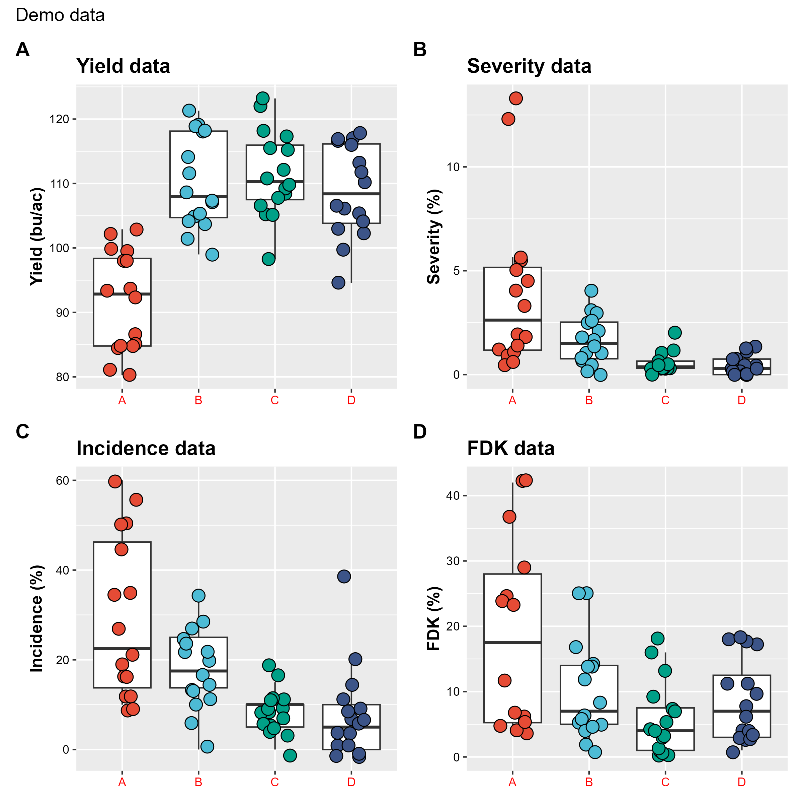
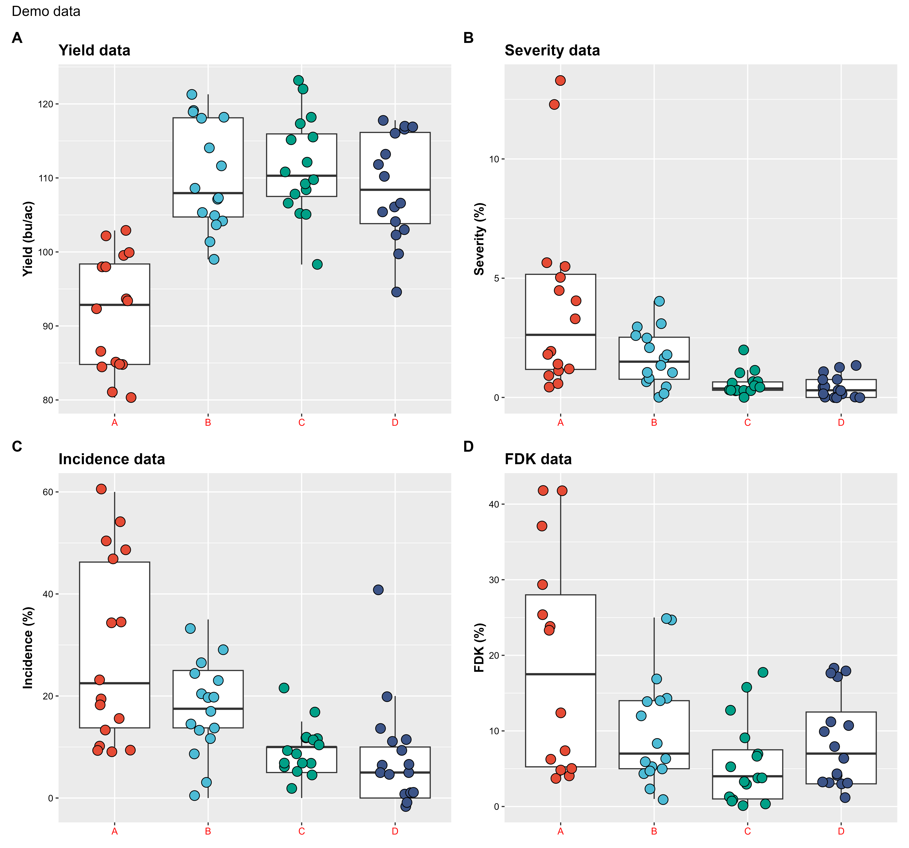

```{r,echo=FALSE}
# This lesson has a lot of content that people will likely reference multiple times when creating plots. Because of that, I have re-organized certain parts to make the lesson easier to follow and navigate through. I've also added to the introduction section a more specific roadmap so that users can more easily understand the flow of this lesson/the process of creating a graph with ggplot2. 
```
---
title: "**ggplot2: a package for creating visualizations in R**"
author: "Paul Esker; Mauricio Serrano; Felipe Dalla Lana"
output:
  html_document:
    code_folding: show
    toc: true
    toc_float:
      toc_depth: 4
      collapsed: true
      smooth_scroll: true
---

## **Introduction**

In the last class, we learned everything from basic concepts of R to data wrangling. The current class focuses on communicating results using graphical methods. For this, we will use the `ggplot2` package, a popular and robust package for data visualization. 

`ggplot2` was developed by Hadley Wickham, Winston Chang, Lionel Henry, Thomas Lin Pedersen, Kohske Takahashi, Claus Wilke, Kara Woo, Hioraki Yutani, and Dewey Dunnington. It is included as a 'core' package of `tidyverse`. This means that `ggplot2` follows the same core structure as `tidyverse` and that it is installed with `tidyverse`. `ggplot2` is one of the most popular R packages because it can be used to produce a great variety of quality plots. There are a number of packages that build on `ggplot2` functionality (also known as 'extensions') that we will talk about later in this section.

```{r,echo=FALSE, out.width='75%', fig.align='center', fig.cap='[Source](https://github.com/allisonhorst/stats-illustrations/blob/master/rstats-artwork/ggplot2_masterpiece.png)'}
# knitr::include_graphics("figures/intro_r/ggplot2_masterpiece.png")
```

<br>

The structure of `ggplot2` was inspired by the book [The Grammar of Graphics](https://www.amazon.com/Grammar-Graphics-Statistics-Computing/dp/0387245448), by Leland Wilkinson. One of the strengths of `ggplot2` is the ability to *build* on a basic plot by adding new components as *layers*. This allows the user flexibility in building graphics with their desired characteristics. A base plot is created with `ggplot()`, and more `ggplot2` components can be added to modify the graph. 

### **Components of ggplot2 plots**
The most important components of ggplot2 graphs are:

-   **Geometric Elements**: where you can determine your plot type 
-   **Aesthetics**: where you can use `aes()` arguments (short for 'aesthetics') to assign characteristics like color and size to elements of your graph
-   **Scales**: where you can applied *scaled* characteristics, like gradients of color, to your graph
-   **Facets**: where you can split graphs by variable(s) to create meaningful figures
-   **Labels**: where you can add elements like subtitles and legends to your graphs
-   **Themes**: where you can assign an overall aesthetic style to your graphs

We will use the example data from the last lesson to illustrate the uses of these functions and components to you. We will also teach you how to combine your graphs to create compelling figures, and to save these figures to maintain their quality in manuscripts and presentations. We will then briefly introduce you to some of `ggplot2`'s many extension packages, which may allow you to create an even greater variety of figures and custom features. 

### **ggplot2 extension packages**

There are extension packages that expand the geometric elements and other functions from `ggplot2`. You can check a gallery of different extension following this [link](https://exts.ggplot2.tidyverse.org/gallery/). A few examples are shown below.

```{r,echo=FALSE, out.width='100%', fig.align='center', fig.cap='Examples of `ggplot2` extension packages. From left to right: `ggwordcloud`, `ggridges`, and `gggenes`'}
knitr::include_graphics("figures/intro_r/extention_ggplot2.png")
```

# **Hands-on plotting**

First, we will load in `ggplot2` and our example data from the last lesson (Intro to R). Remember that `ggplot2` is a core package in `tidyverse`, so it can be loaded with `library("ggplot2")` or `library("tidyverse")`.

```{r}
library(tidyverse)

data_demo <- readr::read_csv("data/intro_r/data_demo.csv")
data_demo 
```

<br>

Every `ggplot2` plot starts with the function, `ggplot()`. This initializes the plot, and is where you will define the data you want used to create the plot. In this case, the data we want to use is in the data_demo object we just loaded in. Let's investigate how `ggplot()` works without any input:

```{r message=FALSE, warning=FALSE}

ggplot()
```

<br>

Note: when you do not inform `ggplot2` of what data you want to plot, the function `ggplot()` will only print a gray panel. It has initialized the plot, but doesn't have any data to map yet.

This is where *data* and *aesthetics* enter the discussion as arguments within the `ggplot()` function. The data argument is pretty self-explanatory, but the arguments within `aes()` determines the appearance of the plot. In this case, it determines the variables we are going to map and which axis they will belong to.

```{r}
ggplot(data = data_demo, aes(x = trt, y = yld)) # Remember, aes is short for aesthetics
```

<br>

So far, we have only told `ggplot()` that our graphic will have information about treatments values in the x-axis and the variable yield on the y-axis. However, there are plenty of plots that could be created with quantitative and qualitative variables, such as box plots or line plots.

At this point, we will indicate to R exactly what type of plot we want to create. This is where information about the *geometric elements* is considered.

## **Geometric components: determining the kind of plot with `geom_*()`**

In this step, we indicate to R the specific type of graphic we are going to create (line plots, point charts, histograms, etc.,) with the material used or defined in in `ggplot()`. We do this by adding a geometric component with one of many `geom_*()` functions. 

Below is an example plotting the points (or raw data) from data_demo as a point graph.  We do this by adding a new layer, with `geom_point()`, to tell `ggplot` to show us a point graph. 

```{r}
# Note that we use the '+' sign to connect the second line of code to the first. 
ggplot(data = data_demo, aes(x = trt, y = yld)) + 
  geom_point()

```

<br> 

We've successfully created a point graph using a `geom_*()` function. But it could be presented in a better manner. We can use a different `geom_*()` function to assign a different plot type. In this case, `geom_jitter()` adds a small amount of random variation to the location of each data observation. 

```{r}

ggplot(data = data_demo, aes(x = trt, y = yld)) +
  geom_jitter()

```

<br>

### **Modifying geometric layers with arguments**
We can see the individual data points more easily, but it's hard to tell which treatments they come from. We can use argument 'width' within the `geom_jitter()` function to reduce the amount of dispersion along the x-axis. 

```{r}
# By default, the 'width' value of 'geom_jitter()' is 0.4. Here we halve the variation applied with 'geom_jitter()' by specifying 'width' to 0.2.
ggplot(data = data_demo, aes(x = trt, y = yld)) + 
  geom_jitter(width = .2) 

```

<br>

Note: all `geom_*()` functions (geom_jitter(), geom_bar(), etc.,) have additional arguments that can be added or modified, depending on the need. To find out what arguments are available or what default values are, try `?geom_*()` to pull up information about the different `geom_*()` functions in RStudio. You can also use a [data visualization cheat sheet]("https://github.com/rstudio/cheatsheets/blob/main/data-visualization-2.1.pdf"). 
More translations of this cheat sheet can be found [here]("https://github.com/rstudio/cheatsheets/tree/main/translation").

```{r,echo=FALSE, out.width='100%', fig.align='center', fig.cap='Examples of `geom_*` functions'}
knitr::include_graphics("figures/intro_r/geom_cheatsheet.png")
```

<br>

### **Common plots made with `geom_*()`**

While point graphs may illustrate the dispersion in a data set well enough, they are not the only way to represent the data. 
We will use different `geom_*()` functions to illustrate some of the different ways to visualize the data. Extension packages may have even more `geom_*()` functions that will allow you to create even more types of plots. 

**Boxplot** (`geom_boxplot()`)

```{r}

ggplot(data = data_demo, aes(x = trt, y = yld)) + 
  geom_boxplot() 

```

<br>

**Violin plot** (`geom_violin()`)

```{r}

ggplot(data = data_demo, aes(x = trt, y = yld)) + 
  geom_violin() 

```

<br>

**Dot plot** (`geom_dotplot()`)

```{r}

ggplot(data = data_demo, aes(x = trt, y = yld)) + 
  geom_dotplot(binaxis = "y", stackdir = "down") 
# 'binaxis' argument tells R how to group the data. 'stackdir' determines how to distribute the dots along the x-axis. 

```

<br>

### **Layering geometric components**
We can think about using `geom_*()` functions as creating layers for our plot. We can stack these functions to improve the quality of the plot, provide more information about the data, and to compare different factors of interest. 

```{r}
# Layer a box plot with a point chart:

ggplot(data = data_demo, aes(x = trt, y = yld)) +
  geom_boxplot()+ 
  geom_jitter(width = .2, size = 4) 

```

<br>

These `geom_*()` features will 'layer' on top of each other in the order they're added, meaning that the last `geom_*()` function used will be laid over the preceding ones. There is technically no limit to the number of layers (geom\_\*) that you can use in a plot, but using too many can make your plots confusing. 

```{r}
# Applying multiple layers (box plot, point chart, violin plot)

ggplot(data = data_demo, aes(x = trt, y = yld)) +
  geom_boxplot()+ 
  geom_jitter(width = .2, size = 4)+
  geom_violin() # Note that the violin plot is the last layer to be added, meaning it will be applied over the other features. 

```

<br>

Sometimes reordering the `geom_*()` layers can improve the visibility of a graphic, along with adding arguments to resize features.  

```{r}
# Multiple layers, different order: 

ggplot(data = data_demo, aes(x = trt, y = yld)) +
  geom_violin()+
  geom_boxplot(width = 0.3)+ # using the argument width we can adjust the box size
  geom_jitter(width = .2, size = 4)
  
```

<br>

Now we can learn to add aesthetics like color, different shapes and size, and more to our plots with `aes()` arguments. 

## **Aesthetic components: modifying plot aesthetics with 'aes()' arguments**

The next component in `ggplot2` plots is aesthetics, which is how our observations will be mapped in the plot. So far, we have used aesthetics to define x and y-axis positions with `aes()` arguments within the base function `ggplot()`. 

Aesthetics can refer to multiple characteristics. The most common characteristics changed with aesthetics are: 

-   Axis-variable assignment
-   Colors
-   Size 
-   Shape 
-   Line type

### **Axes-variable assignment**

We've actually already used `aes()` arguments within `ggplot()` to assign variables 'trt' and 'yld' to the x and y-axis. Look at what happens if we don't:

```{r}
ggplot(data = data_demo) 
```

<br>

R can't create a plot because it doesn't know which of data_demo's variables to use.

### **Colors**

Within a given plot, there are multiple items that we can assign colors to. The arguments `color` (or `colour`), `fill`, and `alpha` enable you to assign color to different elements of plots. `color` assigns color to points or lines. `fill` assigns color to enclosed spaces (within box, polygons, circles, etc.,). `alpha` allows you to control the *transparency* of colors within these elements. 

We can add the `color` argument to our base function, `ggplot()` to assign colors to different treatments. 

```{r}

ggplot(data = data_demo, aes(x = trt, y = yld, color = trt)) +
  geom_boxplot()+ 
  geom_jitter(width = 0.2, size = 4)
  
```

<br>

What if we only want color applied to the points, and not to the box plot component?

```{r}

ggplot(data = data_demo, aes(x = trt, y = yld)) +
  geom_boxplot()+ 
  geom_jitter(aes(color = trt), width = 0.2, size = 4)
  
```

<br>

Compare this to the last plot. When we assign the `color` argument to a geom layer *instead of* to the base plot function, the colors are only applied to that layer. 

We can apply color only to the box plot components of the graph, and not to the points by applying a color argument to the `geom_boxplot()` layer. Instead of using `color`, we use `fill` to color the area within the box. 

```{r}

ggplot(data = data_demo, aes(x = trt, y = yld)) +
  geom_boxplot(aes(fill = trt))+
  geom_jitter(width = 0.2, size = 4)
  
```

<br>

We can use `alpha` to shade points according to their 'yld' variable:

```{r}

ggplot(data = data_demo, aes(x = trt, y = yld)) +
  geom_boxplot(size=2)+
  geom_jitter(aes(alpha = yld), # Here we are using alpha to show a yield gradient on the points
              width = 0.2, size = 4) # We increase the point size to see the differences better 
  
```

<br>

If we use these arguments (color, fill, and alpha) *outside* of the aesthetic function, they change the whole element. Instead of using color to distinguish between different treatments or values, we color all of a certain element. For instance, the box plots can *all* be filled in green, the violin plots can *all* be outlined in red, and *all* data points can be a transparent black-grey. 

```{r}

ggplot(data = data_demo, aes(x = trt, y = yld)) +
  geom_violin(color = "red")+ # border color equal to red
  geom_boxplot(width = 0.3, fill = "green")+ # fill equal to green
  geom_jitter(alpha = 0.4, # 60% of transparency
              width = 0.2, size = 4) 
  
```

<br>

We will learn even more about assigning colors to different plot elements when we look at the scale component of ggplots. For now, we can move on to other `aes()` arguments.  We will also learn how to reference many different colors and shades, like `"green"`, `"lightgreen"`, and `"olivegreen"` when we learn about using scale components to modify plot colors.

### **Size**

The `size` aesthetic allows us to change the size of certain elements. See how we can size data points in accordance to their severity values:

```{r}

ggplot(data = data_demo, aes(x = trt, y = yld)) +
  geom_boxplot()+ 
  geom_jitter(aes(size = sev), #The size of the point changes depending on the severity value
              width = 0.2)
  
```

<br>

We can size other `geom_*()` elements to change the appearance of our plots, without adding any visual information. 

```{r}

ggplot(data = data_demo, aes(x = trt, y = yld)) +
  geom_boxplot(size = 4) 

```

<br> 

We will learn more about sizing plot elements when we learn about scale components. For now, we can move into using aesthetics components to determine shape. 

### **Shapes**


<br>

There are many shapes included in `ggplot2()`, with the most common shown below. The numbers assigned to these shapes make it easy to 'call' them when building plots.

```{r,echo=FALSE, out.width='50%', fig.align='center', fig.cap='Different shape options'}
knitr::include_graphics("figures/intro_r/shapes.png")
```

<br>
Notice how shapes 21- 25 can have an outline color and fill, while the others only have color. 

We can apply shapes to certain elements of our plots with the `shape` argument within `aes()`. Here, we set shape to distinguish between different treatments, with R choosing to use shapes 0-4. 

```{r}

ggplot(data = data_demo, aes(x = trt, y = yld)) +
  geom_boxplot()+ 
  geom_jitter(aes(shape = trt), 
              width = 0.2, size = 4)
  
```

<br>

We can also use the `shape` argument to assign specific shapes to *all* points by taking it out of the `aes()` argument:

```{r}

ggplot(data = data_demo, aes(x = trt, y = yld)) +
  geom_boxplot() +
  geom_jitter(shape = 9)

```

<br>

We will learn more about setting specific symbols for specific variables and elements when we learn about scale components. 

### **Line types**

There are several line types available in R that can be viewed below. These line types can also be referenced easily by their numbers. 

```{r,echo=FALSE, out.width='75%', fig.align='center', fig.cap='Built-in line types'}
knitr::include_graphics("figures/intro_r/line_types.png")
```

We can use the `linetype` argument to assign different types of lines to different groups of data. Here we use `linetype` aesthetics to distinguish between two groups in the data, R (resistant) and S (susceptible).

Notice that we use a new `geom_*()` function and it's `aes()` arguments to create a line graph.

```{r}

# We group the data by treatment and variety, and summarize the mean severity
data_line <- data_demo %>% 
  group_by(trt, var) %>% 
  summarise(sev = mean(sev))  
data_line

# Then we create a plot with different line types for treatments where var=R or var=S. Notice that we use the data structure 'data_line', which we created above.
  ggplot(data_line) +
  geom_line(aes(x = trt,
                y = sev, 
                linetype = var, # Setting line type to distinguish between R and S varieties
                group = var),   # Telling R that it should group the data by variety
                linewidth = 1)  # Setting the thickness of the lines

```

<br>

We can also use `linetype` to set the type of line used for all data by taking it out of `aes()`.

```{r}

ggplot(data = data_line, aes(x = sev, y = yld)) +
  geom_line(aes(x = trt,
                y = sev,
                color = var, # Distinguish between R and S by color of line, rather than line type
                group = var),
                size = 1,
                linetype = "dashed")

# Using 'linetype = 2' produces the same result as 'linetype = "dashed"'

```

<br> 

As with the other aesthetic elements, we will learn more about setting line types when we learn about scale components. 

## **Scale components: building on `aes()` arguments**

So far, we have built plots using the base function `ggplot()` and layering on `geom_*()` elements, and `aes()` arguments to determine plot type and style the plot. We can further customize our plots with scale components. 

Scale components control how aesthetics are mapped. For each aesthetic we've learned about, there is a corresponding scale function. Just as in the aesthetics section, we can start by looking at how scale elements can be used to modify axes. 

### **Modifying continuous plot axes**

Let's say we want to create a dot chart and box plot representation of our data, with treatment (which is categorical) as the x-axis, and yield (quantitative) as our y-axis. We could just do this:

```{r}

ggplot(data = data_demo, aes(x = trt, y = yld)) +
  geom_boxplot() +
  geom_jitter(aes(fill = trt),
              shape = 21,
              width = 0.2,
              size = 4,
              show.legend = FALSE)
```

<br>

R and `ggplot2` do a good job of setting the range and tick-mark location for the y-axis. But, if needed, we can further modify the range and tick-marks of both x and y-axes with functions `scale_x_continuous()` and `scale_y_continuous()`. 

Let's say you want more room to put labels or images on this plot for your poster, presentation, or manuscript. You also will want to label the y-axis. We can do both of these things for the y-axis with `scale_y_continuous`:

```{r}

ggplot(data = data_demo, aes(x = trt, y = yld)) +
  geom_boxplot() +
  geom_jitter(aes(fill = trt),
              shape = 21,
              width = 0.2,
              size = 4,
              show.legend = FALSE) +
  scale_y_continuous(name = "Yield", # Set the y-axis label to "Yield"
                     limits = c(70,130)) # Expand the lower and upper limits of the y-axis to 70 and 130

```

<br>

This is good, but imagine you want the tick-marks to occur at more frequent intervals:

```{r}

ggplot(data = data_demo, aes(x = trt, y = yld)) +
  geom_boxplot() +
  geom_jitter(aes(fill = trt),
              shape = 21,
              width = 0.2,
              size = 4,
              show.legend = FALSE) +
  scale_y_continuous(name = "Yield", # Set the y-axis label to "Yield"
                     limits = c(70,130), # Expand the lower and upper limits of the y-axis to 70 and 130
                     breaks = c(seq(70,130,10))) # Tick marks occur at every 10th value between 70 and 130

```

<br> 

Remember, these same operations can be applied to the x-axis with `scale_x_continuous`. It doesn't make sense to do this on categorical data like treatment, but it can be helpful if you have a quantitative x variable. You could create a plot to visualize the relationship between two continuous variables, severity and yield:

```{r}

ggplot(data = data_demo, aes(x = sev, y = yld)) +
  geom_jitter(aes(fill=trt),
              shape = 21,
              width = 0.2,
              size = 4,
              show.legend = FALSE) +
  scale_y_continuous(name = "Yield", 
                     limits = c(70,130), 
                     breaks = c(seq(70,130,10))) +
  scale_x_continuous(name = "Severity",
                     limits = c(0,15))

```

<br>

We can also use `scale_y_continuous` to add a third axis to our plot. Image we want to represent our yield values in two different units. We can plot one unit along the y-axis, and use the `sec.axis` argument of the `scale_y_continuous` function to create an axis with the *other* set of units on the opposing side of the plot:

```{r}

ggplot(data = data_demo, aes(x = trt, y = yld)) +
  geom_boxplot()+ 
  geom_jitter(aes(fill = trt), shape = 21, width = 0.2, size = 4, show.legend = FALSE)+
  
  scale_y_continuous(name = "Yield (bu/ac)", 
                     limits = c(70, 130),
                     breaks = c(seq(70,130,10)),
                     
            # Here we add a second axis
            sec.axis = sec_axis(trans = ~ . *0.0672, # Transform yield from bu/ac to ton/ha
                                name =  "Yield (ton/ha)", # New axis name
                                breaks = c(seq(4.5,9,0.5)))) # Axis breaks

```

<br>

Tip: You can use `sec.axis = dup_axis())` to simply duplicate the y-axis to the other side of the plot if you want the same values on each side for easier reference.

#### **Further modifying discrete axes**

Just as with axes defined by continuous variables, we can use scale components to modify axes with discrete variables. With either scale_x_discrete() or scale_y_discrete() we can rearrange and exclude levels/values of discrete variables. 

We will use treatment('trt') again as the x-axis to show how we can modify axes of discrete variables:

```{r}

ggplot(data = data_demo, aes(x = trt, y = yld)) +
  geom_boxplot()+ 
  geom_jitter(aes(fill = trt), shape = 21, width = 0.2, size = 4, show.legend = FALSE) +
  # We use scale_x_discrete:
  scale_x_discrete( 
              limits = c("B", "A", "D")) # Exclude trt "C"
   
```

<br>

Note: R will give a warning message letting us know that there are missing values. This is because using `limits = c("B", "A", "D"))` transformed all "C" treatments to NA's. 

<br>

We can also re-label the treatments along the x-axis using the `labels` argument within `scale_x_discrete`:

```{r}

ggplot(data = data_demo, aes(x = trt, y = yld)) +
  geom_boxplot()+ 
  geom_jitter(aes(fill = trt), shape = 21, width = 0.2, size = 4, show.legend = FALSE)+
  
  scale_x_discrete( 
            labels = c('B' = 'New Label', # Re-label trt "B" as "New Label 1"
                       'D' = 'New Label \n in two lines')) # Trt "D" becomes "New Label 2                                                               in 2 lines"

```

<br>

Tip: You can use "\n" to break the label into multiple lines. Just insert the "\n" where you want the break. 

### **Further modifying colors**

Just as with color aesthetic elements, we can modify 'color', 'fill', and 'alpha' to better represent our data. We can use scale elements in `ggplot2` to represent categorical and quantitative data with a range of color and transparencies. Similarly to the color aesthetics section, `color` and `fill` arguments are very similar. To avoid redundancy, we will use `fill` only. Keep in mind, however, that you can use `color` in the same way. 

Colors in R may be referenced or accessed in several different ways. In base R, colors have names like those shown in the next image. You can see a list of colors using `colors()`. These colors are also defined by the RGB code, an additive combination of **R**ed, **G**reen, and **B**lue. Users can also reference these colors using their 'hex' code (hexadecimal code), which is constructed of a 6 character combination of letters A-F and numbers 0-9. For example, the same color can be referenced with `"yellow"` and with `"FFFF00"`. Additionally, the hex code can be extended to an 8 character code, with the last two characters representing color transparency. For example, `"FFFF0050"` would be yellow at 50% transparency. 

```{r,echo=FALSE, out.width='75%', fig.align='center', fig.cap='Some R colors, hex code formatting, and RGB scheme'}
knitr::include_graphics("figures/intro_r/color.png")
```

<br>

Selecting colors for a plot may sound trivial, but it can influence how interpretable your figures are and is often challenging. There are many things to consider when designing or choosing a color scheme/pallet. We need to consider whether viewers will be able to distinguish between different hues, especially for colors commonly confused with color-blindness such as red and green. These considerations and others constitute good practices for data visualization. Although this is not a part of this course, we highly recommend that you look for more information on these topics to maximize the impact of your figures. 

#### **Color resources**

Fortunately, there are plenty of resources, including R packages, from which you can choose color pallets. The most popular of these is the 'ColorBrewer' project designed by Penn State professor [Dr. Cynthia A. Brewer](https://sites.psu.edu/cbrewer/). This project has both an interactive [website](colorbrewer2.org) for choosing pallets and an R package [`rcolorbrewer`](https://cran.r-project.org/web/packages/RColorBrewer/index.html). The website has helpful suggestions for pallets of sequential, diverging, and qualitative data, as well as pallet options for color blindness and printing. 

```{r,echo=FALSE, out.width='100%', fig.align='center', fig.cap='Colorbrewer2.org; 1 - number of classes; 2 - type of data; 3 - color pallet options; 4 - printing/fill options; 5 - details on colors used'}
knitr::include_graphics("figures/intro_r/brewer.png")
```

<br>

The Color Brewer project was so popular that functions from the package `scale_color_brewer()` and `scale_fill_brewer()` became native (included) to `ggplot2`. `rcolorbrewer` also contains some pre-defined color pallets that can be viewed with `display.brewer.all()`. 

This is an example of how a `ggplot`/`rcolorbrewer` function and pre-defined pallet can be applied to add a color 'layer' to our plot:

```{r}
ggplot(data = data_demo, aes(x = trt, y = yld)) +
  geom_boxplot()+ 
  geom_jitter(aes(fill = trt), 
              shape = 21, width = 0.2, size = 4)+
  scale_fill_brewer(palette = "Paired") # R automatically identifies the number of 'classes' (treatments, in this case) and applies pallet colors accordingly

```

<br>

Other developers have created packages for color pallets, such as package [`ggsci`](https://cran.r-project.org/web/packages/ggsci/vignettes/ggsci.html). In `ggsci`, pallets were created using colors from a group of scientific journals. 

Here we provide an example of `ggsci` function `scale_fill_npg()` to apply colors to our plot. 
```{r}

library(ggsci)

ggplot(data = data_demo, aes(x = trt, y = yld)) +
  geom_boxplot()+ 
  geom_jitter(aes(fill = trt), 
              shape = 21, width = 0.2, size = 4)+
  scale_fill_npg() # Just like rcolorbrewer, the number of classes are automatically determined and colors from the pallet are applied

```

<br>

#### **Applying colors to continuous/quantitative data**

We can use a gradient of color to represent quantitative values. There are three major color scale functions: `scale_fill_gradient()`, `scale_fill_gradient2()`, and `scale_fill_gradientn()`. These functions can be used to apply a different number of colors to quantitative data. Alpha values, which determine the transparency of the color, can also be scaled for quantitative variables with `scale_alpha_*()` functions. 

The first fill function, `scale_fill_gradient()`, can be used to create a gradient from two colors to represent low and high values. Here, we create a plot where bluer points indicate low FDK values and redder values high. Data points with NA values are indicated in black. 

```{r}

ggplot(data = data_demo, aes(x = trt, y = yld)) +
  geom_boxplot()+ 
  geom_jitter(aes(fill = fdk), # This tells R to color according to fdk variable
              shape = 21, width = 0.2, size = 4)+
  scale_fill_gradient(low = "blue",
                      high = "red", 
                      na.value = "black")

```

<br>

The second function, `scale_fill_gradient2()` can be used to create a gradient with three colors, representing low, intermediate, and high values. Here, we add the use of the color yellow to represent intermediate values:

```{r}

ggplot(data = data_demo, aes(x = trt, y = yld)) +
  geom_boxplot()+ 
  geom_jitter(aes(fill = fdk), 
              shape = 21, width = 0.2, size = 4)+
  
  scale_fill_gradient2(low = "blue", 
                       mid = "yellow", 
                       high = "red",  
                       midpoint = 21, # Define the middle point value. Default is 0
                       na.value = "black") 
```

<br>

Note that ggplot will distribute the color symmetrically from the middle point. Depending on where you define the middle point, true red or blue values may not be reached. In this case, the distribution of values is represented well with 21 as the mid point. 

Function `scale_fill_gradientn()` can be used to create a gradient from any number (n) of colors. Here we apply a rainbow of colors to represent FDK values. 

```{r}

ggplot(data = data_demo, aes(x = trt, y = yld)) +
  geom_boxplot()+ 
  geom_jitter(aes(fill = fdk), 
              shape = 21, width = 0.2, size = 4)+
  
  scale_fill_gradientn(colours = c("#FF0000", "#FFFF00", "#00FF00",
                                   "#00FFFF", "#0000FF", "#FF00FF")) 

```

<br>

#### **Color transparency**

Earlier, we used `geom_jitter(aes(alpha = fdk))` to apply alpha transparency values to a plot. 

```{r}
# Without specifying the scale, R will assume the default values
# therefore, here we would have the same results as if we have
# scale_alpha_continuous(range = c(0.1,1))

ggplot(data = data_demo, aes(x = trt, y = yld)) +
  geom_boxplot()+ 
  geom_jitter(aes(alpha = fdk), # Setting alpha values
              width = 0.2, 
              size = 4)
```

<br>

By default, the range of transparency values applied to the above plot range from 0.1 to 1.0. With function `scale_alpha_continuous()`, we can exert more control over the range of transparency values applied to the plot. Here, we adjust the range of color transparency with the `range` argument to produce a plot with a more constrained set of shades. 

```{r}

ggplot(data = data_demo, aes(x = trt, y = yld)) +
  geom_boxplot()+ 
  geom_jitter(aes(alpha = fdk), 
              width = 0.2, size = 4)+
  scale_alpha_continuous(range = c(0.3, 0.6)) # Set transparency values at 0.3 (30%) to 0.6 (60%) of shade

```

<br>

Setting `range` values can improve the visibility of certain data points. Smaller FDK values became more visible against the light background of the plot. 

Note that there are two observations in treatment A where the color transparency did not change. These two observations represent points without values (NAs) for variable FDK. There are a few some strategies to deal with this problem.

The first solution could be to remove those two observations with missing values. This would eliminate the two data points on the graph, but the box plots would also be affected. 

A better option is to represent these NA observations with a different color or shape. To achieve this, we can take advantage of the layer design of `ggplot2` and the `na.value` argument of `scale_alpha_continuous`. We can use `na.value = 0` to set the transparency of any NA values to 0%, which is invisible. Then, we can use a *second* `geom_jitter()` layer to add the problematic observations back in, represented by a different shape with `shape = 8`. By not including the `alpha` argument in the new `geom_jitter()` layer, we make it so that points from this new layer are not affected by `na.value = 0`. 


```{r}
ggplot(data = data_demo, aes(x = trt, y = yld)) +
  geom_boxplot()+ 
  geom_jitter(aes(alpha = fdk), 
              width = 0.2, size = 4)+
  
  geom_jitter(data = filter(data_demo, is.na(fdk)), # Add 2nd geom_jitter layer with only NA observations
              aes(x = trt, y = yld), 
              shape = 8, # Define a different shape for the NA observations
              width = 0.2, height = 0, size = 4)+ 
  
  scale_alpha_continuous(range = c(0.4, 1), 
                         na.value = 0)  # Set transparency of observations where FDK is NA to 0. It will only be applied to geom layers where alpha is defined. 

```

<br>

This is an example of how we can creatively use the layered design of `ggplot2` to create customized plots. This kind of technique can be applied to other situations, such as when there is a need to emphasize a particular observation in the data. 

Tip: Notice that applying a color-related scale component to a plot where no `color`, `fill`, or `alpha` arguments are defined doesn't work to apply any change in color or transparency:

```{r}

ggplot(data = data_demo, aes(x = trt, y = yld)) +
  geom_boxplot()+ 
  geom_jitter(aes(size = fdk), # Instead of 'alpha', we used 'size'
              width = 0.2, size = 4)+
  
  geom_jitter(data = filter(data_demo, is.na(fdk)), 
              aes(x = trt, y = yld), 
              shape = 8, 
              width = 0.2, height = 0, size = 4)+ 
  
  scale_alpha_continuous(range = c(0.4, 1), 
                         na.value = 0)  # There is no alpha feature for this scale to be applied to

```

<br>

Remember that we *build* up plots with these components. In order to scale features like colors, axes, shapes, etc., those features need to be present in another layer of the plot, such as those constructed by functions `ggplot()` or `geom_*()`. 

### **Further modifying size**

Scaling for size is performed similarly to alpha scaling. We can use `scale_size_continuous()` to apply a range of sizes to data according to their respective values. Arguments `range` and `trans` allow users to set the range of sizes and reverse the order in which they are applied. 

Here we apply `scale_size_continuous()` and `range` to assign size to observations based on the value of variable FDK:

```{r}

ggplot(data = data_demo, aes(x = trt, y = yld)) +
  geom_boxplot()+ 
  geom_jitter(aes(size = fdk), 
              width = 0.2)+
  
  scale_size_continuous(range = c(1, 6)) # These are actually the default values, but you can adjust them to better emphasize larger values
                                       
```

Note that `ggplot2` provides us with a warning message indicate that two values were removed. Color scaling functions like `scale_alpha_continuous()` and `scale_fill_continuous()` simply assigned the NA observations a color or transparency not used in the range of the rest of the data. In contrast, `scale_size_continuous()` *removed* these values. 

Imagine the difficulties associated with automatically assigning NA observations a different point size: Assigning a size *larger* than the 6 used for FDK values of 40 could obscure other data points, and a *smaller* size would be difficult to distinguish from points where FDK is 0, or it would be hardly visible. This is an example showing the importance of understanding how different `ggplot2` functions will deal with NAs, and influences how we can replace those observations in the plot. 

Just like in the last example of `scale_alpha_continuous()`, we will show how to use the layered design of `ggplot2`, along with our understanding of how NA values are handled by `scale_size_continuous` to visualize the data effectively. For fun, we will also use the `trans` argument to reverse the sizing - small values will be represented by large points, and large values by small points. 

```{r}

ggplot(data = data_demo, aes(x = trt, y = yld)) +
  geom_boxplot() + 
  geom_jitter(aes(size = fdk), 
              width = 0.2) + 
  geom_jitter(data = filter(data_demo, is.na(fdk)), # Add 2nd geom layer with NA values
              aes(x = trt, y = yld), 
              shape = 8, 
              width = 0.2, height = 0, size = 4) + 
  scale_size_continuous(range = c(0.25, 5), # Modify range to better visualize the distribution of FDK values
                        trans = "reverse")  # Reverse the default order of sizing
```

<br>

We get the same warning message, but our NA values are still represented in the second `geom_jitter()` layer. 

### **Further modifying shape**

Compared to some of the other scale components of `ggplot2`, scaling the shape of data points is limited. It is inappropriate to use `shape_scale_manual()` to represent continuous values because, unlike shades of color or size, point shapes are discrete units. However, we can still use `shape_scale_manual()` to more specifically assign shapes to represent categories of observations within our data. 

With shape aesthetic components, we were able to tell `ggplot()` to use shapes to indicate different groups of data. We were also able to tell `ggplot()` to use a specific symbol for all point data within the plot. Using `shape_scale_manual()` allows us to assign *specific* shapes to *specific* groups. 

Now we assign shapes 8 (asterisk) and 15 (solid square) to the varieties variable to better illustrate which observations are genetically resistant (R) and which are genetically susceptible (S). 
```{r}

ggplot(data = data_demo, aes(x = trt, y = yld)) +
  geom_boxplot()+ 
  geom_jitter(aes(shape = var), # We will use the factor, variety, to define the different shapes
              width = 0.2, size = 4)+
  
  scale_shape_manual(values = c(8, 15)) # Here we defined two different shapes depending on the variety
```

### **Further modifying line type**

Just like with shape, scaling by line type doesn't work for continuous variables. However, we can use `scale_linetype_manual()` to assign different line types to different categorical variables. 

We'll construct a previous plot without `scale_linetype_manual()` to compare against:

```{r}

# We group the data by treatment and variety, and summarize the mean severity
data_line <- data_demo %>% 
  group_by(trt, var) %>% 
  summarise(sev = mean(sev))  
data_line

# Then we create a plot with different line types for treatments where var=R or var=S. Notice that we use the data structure 'data_line', which we created above.
  ggplot(data_line) +
  geom_line(aes(x = trt,
                y = sev, 
                linetype = var, # Setting line type to distinguish between R and S varieties
                group = var),   # Telling R that it should group the data by variety
                linewidth = 1)  # Setting the thickness of the lines

```

<br>

We've successfully created a plot where varieties R and S are represented by different line types. But if we want specific line types applied to these varieties, we need to use `scale_linetype_manual()` to assign the line types we'd like to use. Remember that different types of lines in `ggplot2` can be referenced by their names or by their numbers. 

We create a plot identical to the one above *except* with `scale_linetype_manual()` defining different line types to use:
```{r}

  ggplot(data_line) +
  geom_line(aes(x = trt,
                y = sev, 
                linetype = var, 
                group = var),  
                linewidth = 1) +
  scale_linetype_manual(values = c("twodash","dashed"))

```

So far, we've seen that `scale_*()` functions can be used to more specifically control plot aesthetics. Now we can move into more advanced functions that will allow us to create more complex figures. 

## **Facet components: Creating multiple plots representing different variables**

### **Facetting by a single variable**
`facet_*()` functions allow us to arrange multiple plots in a side-by-side or grid-like manner, based on a specified variable. In our previous examples, we used shape to differentiate some of our variables, like 'variety' and 'treatment'. Now, we will use `facet_*()` functions to visualize our data with more variables represented. 

Here, we create a faceted plot with `facet_wrap()` to represent yield by treatment type and variety:

```{r}

ggplot(data = data_demo, aes(x = trt, y = yld)) +
  geom_boxplot()+ 
  geom_jitter(aes(fill = trt), shape = 21, width = 0.2, size = 4)+
  scale_fill_npg() +
  # Here we tell R to facet the plot by variety:
  facet_wrap(~var)

```

<br>

Our original plot is now split in two. One side shows yield values of the resistant variety (R) by treatment type, while the other shows the same information for the susceptible variety (S). Notice that the y-axis is the same between these two plots. Using `facet_wrap()` resulted in two standardized plots that can be directly compared. 

We can see that yield values are distinct between R and S varieties, resulting in more constrained boxes in the `geom_boxplot()` layer. This results in some values being defined as outliers. These outliers are represented by both a colored point and a black dot in the `geom_jitter()` and `geom_boxplot()` layers, respectively. Obviously, we don't want some treatments represented twice in our plots, but we also want to show the correct variation within the box plots. 

To do this, we use the `outlier.alpha` argument within `geom_boxplot()` to set the transparency of the black dots to 0, which is invisible. This way, the outliers will be expressed within the `geom_jitter()` layer. Their values will be included when calculating box plots, but won't be visibly represented. 

```{r}
ggplot(data = data_demo, aes(x = trt, y = yld)) +
  geom_boxplot(outlier.alpha = 0) + # Make outliers completely transparent 
  geom_jitter(aes(fill = trt), shape = 21, width = 0.2, size = 4)+
  scale_fill_npg() +
  
  facet_wrap(~var)

```

<br> 

You can see that the black dots representing outliers in the box plot layer are gone. The outlier data points are no longer represented twice within the plots. 

If we wanted to use different y-axis values for each of these two plots, we can use the `scales` argument within `facet_wrap()`. We can also use the `labeller` argument to modify axis labels and the 'strip' text (the text above each plot). 

```{r}
ggplot(data = data_demo, aes(x = trt, y = yld)) +
  geom_boxplot(outlier.alpha = 0) + 
  geom_jitter(aes(fill = trt), shape = 21, width = 0.2, size = 4)+
  scale_fill_npg() +
  
  facet_wrap(~var, 
             scales = "free_y", # Y-axis scales are assigned independently between facets
             labeller = labeller(
                      var = c("R" = "Resistant", 
                              "S" = "Susceptible"))) # Replace 'R' with 'Resistant' and 'S' with 'Susceptible'

```

<br>

The default value for `scales` is 'fixed', which makes standardized plots. Other options for the `scales` argument include 'free' (for both axes) and 'free_x' (for x-axis).

We can also use the `ncol` and `nrow` arguments within `facet_wrap()` to create stacked plots, rather than side-by-side plots:

```{r, fig.height = 7}
ggplot(data = data_demo, aes(x = trt, y = yld)) +
  geom_boxplot(outlier.alpha = 0) + 
  geom_jitter(aes(fill = trt), shape = 21, width = 0.2, size = 4)+
  scale_fill_npg() +
  facet_wrap(~var, labeller = labeller(var = c("R" = "Resistant", "S" = "Susceptible")), 
             ncol = 1, nrow = 2) # Arrange plots in 1 column and 2 rows

```

### **Facetting by multiple variables**

You can create a grid of plots with one variable represented horizontally and the other vertically with `facet_grid()`. We can still represent variety (resistant vs. susceptible) with columns of plots while also representing disease incidence levels in rows. 

Currently, disease incidence level ('inc') is a continuous variable, which would be hard to represent within rows. However, we can transform it into a categorical variable by splitting the values into 'low incidence' (inc < 10) and 'high incidence' (inc > 10). We do this with `mutate()` an `if_else()` function statement.

```{r}

data_grid <- data_demo %>% 
    mutate(inc_cat = if_else(inc <=10, "Low Incidence", "High Incidence")) # If the statement 'inc <= 10' is TRUE, use mutate() to transform new variable 'inc_cat' into 'Low Incidence'. If the statement is FALSE, transform the value to 'High Incidence'
data_grid
# New variable 'inc_cat' is categorical
  
ggplot(data = data_grid, aes(x = trt, y = yld)) +
  geom_boxplot(outlier.alpha = 0)+ 
  geom_jitter(aes(fill = trt), shape = 21, width = 0.2, size = 4)+
  scale_fill_npg() +
  facet_grid(inc_cat~var, # Create grid with variables 'inc_cat' and 'var' with 'inc_cat' as the rows and 'var' as the columns (row variable ~ column variable)
             labeller = labeller(var = c("R" = "Resistant", "S" = "Susceptible")))

```

<br>

We can also use `facet_grid()` in a similar way to `facet_wrap()` to arrange plot facets by a single variable. 

```{r}
ggplot(data = data_demo, aes(x = trt, y = yld)) +
  geom_boxplot(outlier.alpha = 0)+
  geom_jitter(aes(fill = trt), shape = 21, width = 0.2, size = 4)+
  scale_fill_npg() +
  facet_grid(.~var) # Use 'var' as column in the grid. The '.' is used as a place-holder for the row variable. 
  


ggplot(data = data_demo, aes(x = trt, y = yld)) +
  geom_boxplot(outlier.alpha = 0) + 
  geom_jitter(aes(fill = trt), shape = 21, width = 0.2, size = 4)+
  scale_fill_npg() +
  facet_grid(var~.) # Use 'var' as a row. 
```

With this approach, we can achieve the same results as when we used the `ncol` and `nrow` arguments with `facet_wrap(). 

## **Label components: Adding and modifying labels**

We've already seen some ways to modify the labels of our plots. However, using the `labs()` function to add a label component to our plot offers more control and customization. 

We can use `labs()` to add elements like titles, subtitles, captions, etc., as well as to add more descriptive axis labels. 

```{r}
ggplot(data = data_demo, aes(x = trt, y = yld)) +
  geom_boxplot(outlier.alpha = 0)+ 
  geom_jitter(aes(fill = trt), shape = 21, width = 0.2, size = 4)+
  scale_fill_npg() +
  
  labs(
    title = "Here is a title",
    subtitle = "Here is the plot subtitle",
    caption = "This is figure caption",
    tag = "This is a figure reference label", 
    y = "y-axis title",
    x = "x-axis title",
    fill = "fill title"
  )

```

We can further customize these elements with theme components.

## **Theme components: Modifying the appearance of non-data components**

Theme components can be used to modify non-data components of the plot, such as title location, background color, the use of grid lines, and more. `theme_*()` functions are used to add these component. 

`ggplot2` contains 10 pre-set themes and has options to add further customization. Other packages like [`ggthemes()`](https://yutannihilation.github.io/allYourFigureAreBelongToUs/ggthemes/) and [`bbplot()`](https://github.com/bbc/bbplot/) offer more theme pre-sets. Themes can be useful when showing plots in different settings, such as with projectors, on colored paper, or in journals with figure specifications. 

### **Built-in themes**

`ggplot2` has 10 built-in themes that can be quickly applied to plots with individual functions. For example, theme 'bw' is applied with `theme_bw()`. 

```{r}
ggplot(data = data_demo, aes(x = trt, y = yld)) +
  geom_boxplot(outlier.alpha = 0) + 
  geom_jitter(aes(fill = trt), shape = 21, width = 0.2, size = 4) +
  scale_fill_npg() +
  labs(y = "Yield (bu/ac)", x = "Treatments", fill = "Treatments") +
   theme_bw() # Use theme 'bw'

```

<br>

Tip: The 'bw' in theme 'bw' stands for black on white. This high-contrast theme is useful when projecting images. 

The same plot can be constructed with another pre-set theme, such as theme 'minimal':

```{r}
ggplot(data = data_demo, aes(x = trt, y = yld)) +
  geom_boxplot(outlier.alpha = 0) + 
  geom_jitter(aes(fill = trt), shape = 21, width = 0.2, size = 4) +
  scale_fill_npg() +
  labs(y = "Yield (bu/ac)", x = "Treatments", fill = "Treatments") +
   theme_minimal() # Use theme 'minimal'

```

<br>

Examples of all 10 of the pre-set themes of `ggplot2` can be viewed [here](https://ggplot2.tidyverse.org/reference/ggtheme.html).

Themes from extension packages `ggthemes` and `bbplot()` are applied in the same way:

```{r}
# Load in ggthemes and bbplot
library("ggthemes")
library("bbplot")

# Use ggthemes
ggplot(data = data_demo, aes(x = trt, y = yld)) +
  geom_boxplot(outlier.alpha = 0) + 
  geom_jitter(aes(fill = trt), shape = 21, width = 0.2, size = 4) +
  scale_fill_npg() +
  labs(y = "Yield (bu/ac)", x = "Treatments", fill = "Treatments") +
   theme_economist() # Use theme 'economist' from ggthemes

# Use bbplot
ggplot(data = data_demo, aes(x = trt, y = yld)) +
  geom_boxplot(outlier.alpha = 0) + 
  geom_jitter(aes(fill = trt), shape = 21, width = 0.2, size = 4) +
  scale_fill_npg() +
  labs(y = "Yield (bu/ac)", x = "Treatments", fill = "Treatments") +
   bbc_style() # Use theme 'bbc_style' from bbplot

```

### **Creating customized themes**

We can create and apply custom themes as well. `ggplot2` offers many different options, most of which we won't be able to cover. Documentation for all the options in `theme()` can be found [here](https://ggplot2.tidyverse.org/reference/theme.html).

We'll construct a plain plot (using the default theme) for comparison:

```{r}

ggplot(data = data_demo, aes(x = trt, y = yld)) +
  geom_boxplot(outlier.alpha = 0)+ 
  geom_jitter(aes(fill = trt), shape = 21, width = 0.2, size = 4)+
  scale_fill_npg() +
  
  facet_grid(~var, labeller = labeller(var = c("R" = "Resistant", "S" = "Susceptible")))+
  
  labs(y = "Yield (bu/ac)", x = "Treatments", fill = "Treatments") +
  
  theme() # Leaving theme() empty results in the default theme

```

<br>

We can set colors for different areas ('panels') with a variety of `panel.*` arguments. Axes and text objects can be similarly modified with `axis.text.*` and `title` arguments. We can modify the legend with the predictable `legend.*` group of arguments. A variety of `element_*()` functions can be used within these arguments to define colors, sizes, and more. 

Here, we set colors for each panel of the plot, the y-axis, the title, and the legend. We also hide the x-axis, set the size for the title, and move the legend to a new position. We also reformat the strip texts (where 'Resistant' and 'Susceptible' are labelled).

```{r}

ggplot(data = data_demo, aes(x = trt, y = yld)) +
  geom_boxplot(outlier.alpha = 0) + 
  geom_jitter(aes(fill = trt), shape = 21, width = 0.2, size = 4) +
  scale_fill_npg() +
  facet_grid(~var, labeller = labeller(var = c("R" = "Resistant", "S" = "Susceptible"))) + # This is our strip text
  labs(y = "Yield (bu/ac)", fill = "Treatments", 
       x = NULL) + 
  
  # Here is where enact our modifications:
   theme(
      panel.background = element_blank(), # Set background to white 

      panel.grid.major = element_line(colour = "grey88"), # Change the major grid lines to a shade of grey
     
       panel.border = element_rect(colour = "grey80", fill = NA), # Add a border in a shade of grey. Don't fill the space with color

    axis.text.y  = element_text(colour = "black"), # Print the y-axis label in black

    axis.text.x  = element_blank(), # Make the x-axis label a blank space
    
    title = element_text(colour = "black", size = 12, face = "bold"), # Set the title to black, size 12, and in bold font

    legend.position = c(0.90, .20), # Move the legend to these coordinates relative to the image
    
    legend.key = element_rect(fill = "white"), # Fill the legend background with white

    legend.text = element_text(colour = "black", size = 12), # Make legend text black and size 12
    
    # Strip text justified almost completely to the left - (hjust = 0.01)
    # hjust = 0.5 is center justification, and hjust = 1 is right justification
    strip.text.x =  element_text(hjust =0.01, face = "bold", size = 14),
 # Move strip text to the left border (hjust = 0.01) and make the text bold and size 14. 
    # Tip: 'hjust = 1' moves the object to the right border
    
    strip.background =  element_blank()) # Change the background behind strip text from grey to blank (white)

```

<br>

## **Combining plots**

Frequently, we need to combine multiple plots into a single one. While many people copy and paste their plots in a MS Power Point (or similar software) and save as new plot, this approach is very inefficient, compromises quality, and may cause unintentional errors.

A better approach is combine these plots in single one and save. There are a few good packages that can help with this task, including, [`gridExtra`](https://cran.r-project.org/web/packages/gridExtra/index.html), [`cowplot`](https://wilkelab.org/cowplot/index.html), and [`ggpubr`](https://rpkgs.datanovia.com/ggpubr/index.html). We will also explore a new package, and arguably an easier one to use, [`patchwork`](https://patchwork.data-imaginist.com/).

First, let's build some plots to be combined using `patchwork`. We will build four plots, considering the effect of treatment on the following variables: yield, severity, incidence, and FDK.

Now we will create 4 individual plots using custom formatting. We won't be visualizing them to save space on the page. 

```{r}

# Create (but not print) yield data plot:
plot_yield <- 
ggplot(data = data_demo, aes(x = trt, y = yld)) +
  geom_boxplot(outlier.alpha = 0)+ 
  geom_jitter(aes(fill = trt), shape = 21, width = 0.2, size = 4)+
  scale_fill_npg() +
  labs(title = "Yield data", y = "Yield (bu/ac)", x = NULL)+
  theme(
      axis.text  = element_text(colour = "black"),
      title = element_text(colour = "black", size = 12, face = "bold"),
      legend.position = "none")

# Severity plot:
plot_sev <- 
ggplot(data = data_demo, aes(x = trt, y = sev)) +
  geom_boxplot(outlier.alpha = 0)+ 
  geom_jitter(aes(fill = trt), shape = 21, width = 0.2, size = 4)+
  scale_fill_npg() +
  labs(title = "Severity data", y = "Severity (%)", x = NULL)+
  theme(
      axis.text  = element_text(colour = "black"),
      title = element_text(colour = "black", size = 12, face = "bold"),
      legend.position = "none")

# Incidence plot:
plot_inc <- 
ggplot(data = data_demo, aes(x = trt, y = inc)) +
  geom_boxplot(outlier.alpha = 0)+ 
  geom_jitter(aes(fill = trt), shape = 21, width = 0.2, size = 4)+
  scale_fill_npg() +
  labs(title = "Incidence data", y = "Incidence (%)", x = NULL)+
  theme(
      axis.text  = element_text(colour = "black"),
      title = element_text(colour = "black", size = 12, face = "bold"),
      legend.position = "none")

# FDK plot:
plot_fdk <- 
ggplot(data = data_demo, aes(x = trt, y = fdk)) +
  geom_boxplot(outlier.alpha = 0)+ 
  geom_jitter(aes(fill = trt), shape = 21, width = 0.2, size = 4)+
  scale_fill_npg() +
  labs(title = "FDK data", y = "FDK (%)", x = NULL)+
  theme(
      axis.text  = element_text(colour = "black"),
      title = element_text(colour = "black", size = 12, face = "bold"),
      legend.position = "none")

```

<br>

Now we'll load in the `patchwork` package and use the `+` symbol to combine the yield and severity plots we just created:

```{r, fig.width=8}
library(patchwork)

plot_yield+plot_sev
```

<br>

We can also use the `/` symbol to place one plot above the other:

```{r, fig.height=8}

plot_yield/plot_sev

```

<br>

Using `()` allows us to create a hierarchical plotting design. First, yield and severity plots are placed side-by-side, along with incidence and FDK plots. Then, the first group (yield and severity) are placed above the second group, creating a 2x2 grid. 

```{r fig.height=8, fig.width=8}

# Perform operations within parentheses/brackets, then operations outside:
(plot_yield+plot_sev) / 
(plot_inc + plot_fdk)

```

We can further modify this resulting figure with tags and by altering theme settings. To create tags, we use `patchwork` function `plot_annotation`. 

```{r fig.height=8, fig.width=8}

# Recreate the previous plot:
(plot_yield+plot_sev) / 
(plot_inc + plot_fdk) +
  
  # Tag plots with 'A', 'B', 'C', 'D'
    plot_annotation(tag_levels = "A",
                    title = "Demo data")  & 
  
  theme(
    axis.text.x  = element_text(colour = "red")) # Note that '&' is needed to add theme elements here. This is because we are adding a theme layer on top of a 'patchwork' package layer instead of another 'ggplot2' layer. 
  
```

<br>

## **Saving plots**

Finally, we can use the `ggplot2` function `ggsave` to save our plots. We can use `ggsave()` save plots individually, or in `patchwork` combinations like we did in the 'Combining Plots' section. 

```{r fig.height=8, fig.width=8}

# Recreate the previous plot as 'plot_comb' object:
plot_comb <- (plot_yield+plot_sev) / 
(plot_inc + plot_fdk) +
  
  # Tag plots with 'A', 'B', 'C', 'D'
    plot_annotation(tag_levels = "A",
                    title = "Demo data")  & 
  
  theme(
    axis.text.x  = element_text(colour = "red"))

# Save the plot:
ggsave(plot = plot_comb, filename = "figures/intro_r/plot_comb.png")

# We can add arguments 'width', 'height', 'units', and more to 'ggsave()' to manage our image quality: 
ggsave(plot = plot_comb, filename = "figures/intro_r/plot_comb_with_args.png", 
       width = 300, 
       height = 280,
       units = "mm",
       dpi = 450)

```

<br>

Below is how our two saved plots look: 

```{r,echo=FALSE, out.width='100%', fig.align='center', fig.cap='Our two resulting plots with differing ggsave() arguments'}



```

<br>

Notice how different these plots look. This is because the image saved with `ggsave()` arguments specified has different dimensions than the image saved with default `ggsave()` values. We can alter these arguments to change the resolution of these images (for example, increasing resolution for images that will be printed on large posters, or reducing the size of images that will be uploaded/downloaded often). The use of these arguments can influence the size of the text, individual data points, etc., allowing for further control of the image. 

Now that we know the basics for building and saving plots with `ggplot` and its extension packages, we can focus on other topics in plant epidemiology. Please see the navigation menu at the top of the page to learn more about experimental design, sampling methods, and different analyses you can do in R. 