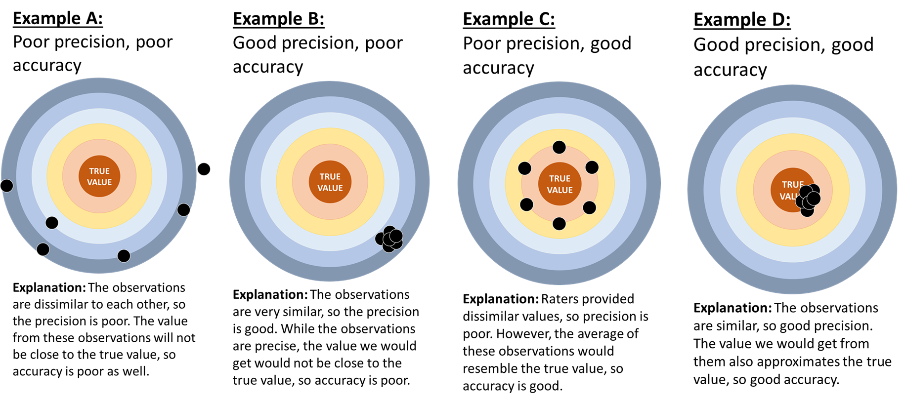

## **Introduction**


The ability to rate disease severity is a crucial tool in plant epidemiological research. Determining disease severity can provide valuable information on which treatments are effective. However, disease ratings can be subjective, and vary from person to person. Information about the *quality* of disease ratings can impact how an analysis is performed. In this lesson, we will learn about several measures that reflect how good a set of ratings are. 

### **Key terms**

> **Precision**, or reliability, is a measure of the *similarity* of multiple ratings on a test subject, irrespective of the true value.

> **Accuracy** is a measure of how *close* the rating value is to the 'true' value.

** Precision and accuracy are related, but they not the same. Precision is how close observations are to each other and accuracy is how the observations compare to the true value.** 

The following figure serves as an illustration of precision and accuracy in disease severity ratings. The center of each figure represents the 'true' value. In this case, we will assume that we know the true value of the rating.

```{r,echo=FALSE, out.width='90%', fig.align='center'}
library("knitr")


```

<br>

Precision can be calculated between a single assessor's rating results (**intra-rater**), or between the results of multiple assessors (**inter-rater**)^2^. The type of calculation performed depends on the number of people rating plant specimens, the time span of the evaluation, and many more factors. 

> **Intra-rater precision** measures if a *single person* produces similar results in similar evaluations. 

A question that could be answered by evaluating intra-rater precision could be "Are this person's ratings consistent across different time periods, or in different circumstances?" 

> **Inter-rater precision** compares the results of *multiple people* rating the same set of specimens.

A question answered by evaluating inter-rater precision could be "Do people provide similar answers when rating the same plants?"

Both intra- and inter-rater precision can also be referred to as 'intra- or inter-*repeatability*', depending on the source.^1^

## **Quantifying Precision and Accuracy**

Plant pathologists use a variety of methods to quantify the precision and accuracy of disease severity ratings. We can often calculate both intra- and inter-rater precision. The statistical approach will often depend on the situation. 

We will discuss the **Concordance Correlation Coefficient** (CCC), a common method for estimating precision and accuracy. In the following examples, we will show how the CCC can be used to gain important information in several different situations. 
<br>

### **About the Concordance Correlation Coefficient**
The concordance correlation coefficient (CCC) is a method developed by Lawrence I-Kuei Lin in 1989^1^. The CCC is a method of determining precision. You might use the CCC to measure the precision among a group of raters (the **inter***-rater* precision), the precision between a single person's ratings from different days (the **intra***-rater precision*). In certain contexts, the accuracy of a set of ratings can be estimated. 

The CCC value ($\hat{\rho_c}$ or simply *CCC*), depends on groups U and W. U is the collection of ratings to be evaluated while W is a more reliable 'test' set of ratings to compare U to. 

You can estimate $\hat{\rho_c}$ by the following equation:

$$ \hat{\rho_c} = \frac{2s_{UW}}{(\overline{U}-\overline{W})^2+s^{2}_{U}+s^{2}_{W}} $$
<br>

$\overline{U}$ and $s^{2}_{U}$ are the *average* and *standard deviation* of U. Similarly, $\overline{W}$ and $s^{2}_{W}$ are the average and standard deviation of W. $s_{UW}$ is the *covariance*.

This equation can be further simplified as the product of two terms:

<br>

$\hat{\rho_c} = r*C_b$. 

<br>

The first term in this simplifed formula is **r**, or the Pearson correlation coefficient. This value quantifies the variability between the measurements of U compared to the variability of W. It ranges from -1 to 1, where a value of 1 indicates a perfect positive association, a value of -1 is a perfect negative association, and 0 indicates no relationship. We can use *r* to create concordance lines. Concordance lines show the relationship between U and W's variability, and the slope is determined by *r*.

The second term is **$C_b$**, which quantifies the *distance* or *shift* between the quantitative value of U and W observations. We can use $C_b$ to create fitted lines showing the relationship between U and W's values. Unlike a concordance line, the slope of a fitted line is not bounded between -1 and 1. 

$C_b$ is calculated using the following equation: 

$$C_b = 2/(\nu + 1/\nu + \mu^2)$$
where $\nu = \sigma_U/\sigma_W$ and $\mu = (\mu_U - \mu_W)/\sqrt{\sigma_U*\sigma_W}$.

$\mu$ quantifies the **location shift**, or the difference in the *y-axis intercept* between the fitted line and the concordance line. In this type of shift, the value between U and W differ by a constant amount. An example of a location shift can be found in the previous charts, where U is compared to W1. 

$\nu$ represents the **scale shift**, or the difference in slopes between the fitted and concordance lines. The value of the concordance line may stay at 1 to indicate perfect positive association, while the slope of the fitted line may increase or decrease to represent a relationship where the rate of change is not a constant. 

<br>

### **Example 1: U versus W1, W2, and W3**
The next example will show the difference between *r* and the concordance line, and $C_b$ and the fitted line. In this example data, values from U will be compared to W1, W2, and W3. *r* will not change because the variability of U will be equal to the variability of W1, W2, and W3. $C_b$ *will* change because the values of W1, W2, and W3 are different in comparison to U. 

```{r , dpi=300, fig.width=8, fig.height=3.5}

# First, we need to load in the appropriate packages
library(tidyverse)
library(patchwork)
library(knitr)
library(kableExtra)
library(ggsci)
library(ggpubr)


# Now, we'll create a data frame with 10 values for U, W1, W2, and W3, respectively. 
data_r = data.frame( 
  U = c(0:10)) %>% 
  mutate(W1 = U+10,  
         W2 = U*2, 
         W3 = U) %>% 
  print() %>% 
  pivot_longer(cols = -U, values_to = "W_values")

# Now we'll create figures showing the fitted and concordance lines of each comparison (U vs. W1, U vs. W2, etc.)

# This creates the fitted line
ggplot(data_r, aes(x=U, y= W_values))+
  geom_abline(intercept = 0, slope = 1, linetype = "dashed") +
  geom_line()+
  geom_point(aes(x=U, y= W_values))+

  facet_wrap(~name)+
  
  labs(x = "Values of U", y = "Values of W")+
  stat_cor(method = "pearson", p.accuracy = 0.001, cor.coef.name = "r")+
  
   theme(
    panel.background = element_blank() ,
    panel.grid.major = element_line(colour = "grey95") ,
    panel.border     = element_rect(linetype = "solid",colour = "grey80", linewidth=0.3, fill = NA),
    
    axis.text  = element_text(colour = "black"),
    plot.title =  element_text(hjust =0, face = "bold", size = rel(1.2)),
    
    strip.text.x =  element_text(hjust =0, face = "bold", size = rel(1.5)),
    strip.background =  element_blank())


```

In the left-most plot, W1 = U + 10. The *r* value between U and W1 is 1 because the *variability* of both groups is identical. This results in a concordance line with a slope of 1. However, the value for $C_b$ has changed. This is because the *values* of U and W1 (0,1,2,... vs. 10,11,12,...). The relationship between U and W has been shifted upward by 10 units. 

In the middle plot, W2 = 2 * U. The variability between U and W is the same, so the concordance line is identical to the last example. However, the relationship between U and W2 is doubled, compared to the last example. The result is a fitted line that starts at 0,0 and has a slope of 2. 

In the right-most plot, W3 = U. *r* is equal to 1 because the variability of U's values and W3's values is identical, and $C_b$ is 1 because the relationship between U's values and W3's values is 1:1. 

### **Example 2:** 

In this example, we will load in an example data set "severity_rates.xlsx" from the "data" folder of this lesson. This data records the disease severity ratings of **20 trifoliate leaves** (leaves composed of 3 leaflets) by **nine raters**. Each trifoliate was **rated twice** (in one of two sets) by each rater. The trifoliates were rated on a **scale of 0%-100%**. Finally, the **deviation** of each rating from the true value was recorded (column 'dev'). 

```{r setup, include=TRUE, message = FALSE, warning = FALSE}

# Import the data and format it to suit our purposes. 
# The next line may need to be modified, depending on your OS.!!!! 
data_rate = readxl::read_xlsx("data/severity_rates.xlsx") %>%
  pivot_longer(cols = -c("set", "leaf_id", "order", "truth"), 
               names_to = "raters") %>% 
  group_by(set, leaf_id) %>% 
  mutate(dev = value-truth,
         set = factor(set, levels = c(1, 2), labels = c("Set 1", "Set 2")))
  
# Inspect the data
head(data_rate)
```

<br>

The plot below is divided into Set 1 and Set 2, with each rater represented by a unique color on the x-axis. The ratings provided ranged from 2%-90% for Set 1, and from 3%-95% for Set 2. The mean and median for all raters were 43.5% and 41% for Set 1, and 39.1% and 35% for Set 2. 

<br>

```{r BOXPLOT_rate, dpi=300, fig.width=8, fig.height=4.5}
# Here we plot a combined boxplot and dotplot showing each person's ratings in both sets.
ggplot(data_rate)+
  geom_boxplot(outlier.alpha = 0, aes(x = raters, y = value))+
  geom_jitter(aes(fill = raters, x = raters, y = value), width = 0.2,
              show.legend = FALSE, shape = 21, color = "black", size = 2)+
  geom_rug(aes(y = truth))+
  
  ggsci::scale_fill_npg()+
  scale_y_continuous(limits = c(0,100))+
  scale_x_discrete(expand =  c(.1,0))+
  
  labs(y = "Severity (%)", x = NULL, 
       title = "Disease severity (%) distribution per rater and set",
       subtitle = "Each point represents a leaf reading \nRugs in the plot left are the true values")+
  
  facet_wrap(~set)+
  
  theme(
    panel.background = element_blank() ,
    panel.grid.major = element_line(colour = "grey95") ,
    panel.border     = element_rect(linetype = "solid",colour = "grey80", linewidth=0.3, fill = NA),
    
    axis.text  = element_text(colour = "black"),
    plot.title =  element_text(hjust =0, face = "bold", size = rel(1.2)),
    
    strip.text.x =  element_text(hjust =0, face = "bold", size = rel(1.5)),
    strip.background =  element_blank())
```

<br>


### **Example 2.1: Intra-rater reliability**

The plot we just created shows that raters did not provide identical values in Sets 1 and 2, even though the same 20 trifoliates were presented. Some variables that could have impacted these ratings include the order in which the trifoliates were presented (they were presented randomly) and the possibility that the raters took a break or re-calibrated how they determine ratings. Either way, there was a change in how each person rated these trifoliates. We need to determine whether the results between Sets 1 and 2 are different enough that it impacts our analysis. 

In the following chunk of code, we will compare each person's ratings in Sets 1 (x-axis) and 2 (y-axis). We will create a a linear regression model to serve as the fitted line (solid line) and compare it to a concordance line (dashed line) indicating perfect agreement. 

```{r Intra-rater reliability, fig.height=8, fig.width=8.5, message=FALSE, warning=FALSE, dpi=300}

# Reformat the data
 data_intra_rate =  data_rate %>% ungroup() %>% 
    select(set, leaf_id, truth, raters, value) %>% 
    pivot_wider(names_from = set, values_from = value) %>% 
    rename(set1 = `Set 1`, set2 = `Set 2`)
 
# Create the concordance lines
 ggplot(data_intra_rate) +
   geom_abline(intercept = 0, slope = 1, linetype = "dashed") +
   
   # Create the fitted lines
   geom_smooth(aes(x=set1, y = set2, color = raters),
               show.legend = FALSE, method="lm", se = FALSE)+
   
   # Plot the Set 1 and Set 2 ratings as x and y's, respectively. 
   geom_point(aes(x=set1, y = set2, fill = raters), size = 3, 
              show.legend = FALSE, shape = 21, color = "black")+

   ggsci::scale_color_npg()+
   ggsci::scale_fill_npg()+
   scale_x_continuous(limits = c(0,100))+
   scale_y_continuous(limits = c(0,100))+  
   
   labs(x = "Ratings from Set 1", 
        y = "Ratings from Set 2", 
        title = "Relationship between dissease assessment from Set 1 and Set 2", 
        subtitle = "Dashed line is the concordance line, solid line is the linear regression")+
   
   facet_wrap(~raters, ncol = 3)+
   theme( panel.background = element_blank() ,
          panel.grid.major = element_line(colour = "grey95") ,
          panel.border     = element_rect(linetype = "solid",colour = "grey80", size=0.3, fill = NA),
     
          axis.text  = element_text(colour = "black"),
          plot.title =  element_text(hjust =0, face = "bold", size = rel(1.2)),
         
          strip.text.x =  element_text(hjust =0, face = "bold", size = rel(1.5)),
          strip.text.y =  element_text(face = "bold", size = rel(1.5)),
          strip.background =  element_blank())
 
```

<br>

We can evaluate the given ratings based on the similarities between the concordance line and the fitted line. We can see that most raters provided consistent results in both Sets 1 and 2, with 6 of the 9 having $\hat{\rho_c}$ above 0.85, and no raters scoring a $\hat{\rho_c}$ below 0.7. 

A look at individual raters shows some differences. R6 showed good accuracy ($C_b$ = 0.93), although their precision was poorer (*r* = 0.75). R9 scored the second lowest $\hat{\rho_c}$ value (0.73) and had more of a problem with accuracy ($C_b$ = 0.85). A closer look into R9's $C_b$ score shows that their $\mu$ value was relatively far above zero ($\mu$ = 0.59). This is because, while disease severity scores at the upper or lower end of the scale were consistent between Sets 1 and 2, the intermediate values were much different. 

The following is a table of each's raters statistics:

```{r intra-rater stats}
table_intra_rater = 
 data_intra_rate %>% 
   group_by(raters) %>% 
   summarise( set_m1 = mean(set1),
              sd1 = sd(set1),
              set_m2 = mean(set2),
              sd2 = sd(set2),
              r   = cor(set1, set2) ) %>%
mutate(v  = (sd1/sd2),
          u  = (set_m1-set_m2)/sqrt(sd1*sd2), 
          cb = 2/((v+(1/v)+u**2)),
          pc = r*cb) %>% 
   mutate_at(c("set_m1", "sd1", "set_m2", "sd2"), round, digits=1) %>% 
   mutate_at(c("r", "v", "u", "cb", "pc"), round, digits=2)

 kable(table_intra_rater, align = "lcccccccc", 
       col.names = c("Rater", "Mean Set1", "SD Set1", "Mean Set2", "SD Set2", "*r*", 
                      "$\\nu$", "$\\mu$", "$C_b$", "$\\hat{\\rho_c}$")) %>% 
 kable_styling("striped")  
 
```

<br>

### **Example 2.2: Inter-rater reliability**

<br>

In the previous example, we saw that individual raters did not always provide the same values, even on the same set of specimens. For this example, we will compare raters to each other to evaluate inter-rater reliability. We will compare each of the 9 raters to R2, the rater with the highest $\hat{\rho_c}$, using only the values from Set 1. 

In the following set of plots, you will see the values given by R2 on the x-axis, and the values of the other rater on the y-axis. A linear regression line has been fitted to the data and can be inspected in comparison to the concordance line. We will also provide a table of each comparison's statistics in comparison to R2. 

```{r Inter-rate reliability, fig.height=12.5, fig.width=8, message=FALSE, warning=FALSE, dpi=300}

# Transform the data 
data_inter_rate = 
data_rate %>% 
  ungroup() %>% 
  select(-dev, -order) %>% 
  filter(set =="Set 1") %>% 
  pivot_wider(names_from = raters, values_from = value) %>% 
  select(-set, -leaf_id, - truth) %>% 
  pivot_longer(-R2, names_to = "raters") %>% 
  mutate(comp = paste(raters, "vs R2"))

# Create the concordance line
  ggplot(data_inter_rate) +
  geom_abline(intercept = 0, slope = 1, linetype = "dashed") +
    
    # Create the linear model 
  geom_smooth(aes(x=R2, y = value, color = comp),
              show.legend = FALSE, method="lm", se = FALSE)+  
  
  geom_point(aes(x=R2, y = value, fill = comp), size = 3, 
             show.legend = FALSE, shape = 21, color = "black")+
  
  ggsci::scale_color_npg()+
  ggsci::scale_fill_npg()+
  scale_x_continuous(limits = c(0,100))+
  scale_y_continuous(limits = c(0,100))+  
  
  labs(y = "Disease severity (%)", x = "Disease severity (%) rating by R2", 
       title = "Relationship between disease severity ratings from 8 raters and R2",
       subtitle = "Rater R2 showed the best intra-rater reliability")+
    
  facet_wrap(~comp, ncol = 2)+
  theme( panel.background = element_blank() ,
         panel.grid.major = element_line(colour = "grey95") ,
         panel.border     = element_rect(linetype = "solid",colour = "grey80", size=0.3, fill = NA),
         
        plot.title =  element_text(hjust =0, face = "bold", size = rel(1.2)),
         axis.text  = element_text(colour = "black"),
         
         strip.text.x =  element_text(hjust =0, face = "bold", size = rel(1.5)),
         strip.text.y =  element_text(face = "bold", size = rel(1.5)),
         strip.background =  element_blank())

```


```{r inter-rater stats}

  data_inter_rate %>% 
    group_by(raters) %>% 
    summarise( set_m1 = mean(value),
               sd1 = sd(value),
               set_m2 = mean(R2),
               sd2 = sd(R2),
               r   = cor(value, R2) ) %>%
    mutate(v  = (sd1/sd2),
           u  = (set_m1-set_m2)/sqrt(sd1*sd2), 
           cb = 2/((v+(1/v)+u**2)),
           pc = r*cb) %>% 
    mutate_at(c("set_m1", "sd1", "set_m2", "sd2"), round, digits=1) %>% 
    mutate_at(c("r", "v", "u", "cb", "pc"), round, digits=2) %>% 
    select(-set_m2, -sd2) %>% 
  
  kable(., align = "lcccccc", 
        col.names = c("Rater", "Mean Raters", "SD Raters", "*r*", 
                      "$\\nu$", "$\\mu$", "$C_b$", "$\\hat{\\rho_c}$")) %>% 
    kable_styling("striped")
 
```

$C_b$ values were $\le 0.7$ on the four raters with the worst performance. Three of these raters (R5, R6, and R7) had $\nu \ge 1.0$, indicating that there was a large scale shift between these raters and R2. R8 were the only rater with $\mu$ close to 0. R4 was the rater with the highest location shift, followed by R6, with $\mu$ equals to 0.78 and 1.37, respectively.

When compared to R2, raters R1, R3, and R9 performed relatively well with $\hat{\rho_c}$ values above 0.8. Raters R4, R5, R6, R7, and R8 had $\hat{\rho_c}$ values below 0.6. The majority of significant differences were observed in the $C_b$ parameter, where the four worst raters ranged between 0.63 and 0.7. Raters R5, R6, and R7 had $\nu$ values above 1.0, showing large scale shifts between these raters and R2, and large $\mu$ values, indicating scale shifts as well. Notably, R4 had a relatively good *r* score (0.78), although their $\hat{\rho_c}$ was overall poor. 

## **Example 2.3: Accuracy**

In the previous two examples (2.1 and 2.2) we have investigated intra-rater reliability and inter-rater reliability. Now we will examine the accuracy of these scores to see how observed values differ from the estimated true values. 

For this comparison, we will only use data from Set 1. In the figure below, we will plot each rater's values (x-axis), by how much they differ from the true value of each trifoliate (y-axis). Then we will plot the relationship between the observed values and the true values and examine how the observed values deviate from the truth. Finally, we will chart each user's statistics.

The value deviation box plot:

```{r error from real, dpi=300, fig.width=8, fig.height=4}

# Plot the score-deviation box plot. Notice how y = dev, in contrast to previous boxplots.
ggplot(data_rate, aes(x = raters, y = dev))+
  geom_boxplot(outlier.alpha = 0)+
  geom_jitter(aes(fill = raters), width = 0.2,
              show.legend = FALSE, shape = 21, color = "black", size = 2)+  
  
  ggsci::scale_fill_npg()+
  scale_y_continuous(limits = c(-50,50))+

  facet_wrap(~set)+
  
  labs(x = "Raters", y = "Deviation from true value")+
  
  theme(
    panel.background = element_blank() ,
    panel.grid.major = element_line(colour = "grey95") ,
    panel.border     = element_rect(linetype = "solid",colour = "grey80", size=0.3, fill = NA),
    
    axis.text  = element_text(colour = "black"),
    
    strip.text.x =  element_text(hjust =0, face = "bold", size = rel(1.5)),
    strip.background =  element_blank())

```

The linear models in comparison to perfect agreement lines:

```{r Accuracy, fig.height=8, fig.width=8.5, message=FALSE, warning=FALSE, dpi=300}


acc_data =
  data_rate %>%  ungroup() %>% 
    filter(set =="Set 1") %>% 
    select(truth, raters, value) %>% 
     group_by(raters)

ggplot(acc_data) +
  geom_abline(intercept = 0, slope = 1, linetype = "dashed") +
  geom_smooth(aes(x=truth, y = value, color = raters),
              show.legend = FALSE, method="lm", se = FALSE)+  
  
  geom_point(aes(x=truth , y = value, fill = raters), size = 3, 
             show.legend = FALSE, shape = 21, color = "black")+
  
  ggsci::scale_color_npg()+
  ggsci::scale_fill_npg()+
  scale_x_continuous(limits = c(0,100))+
  scale_y_continuous(limits = c(0,100))+  
  
  labs(x = "Disease severity (%) true value", 
       y = "Rates estimate by raters")+
  
  facet_wrap(~raters, ncol = 3)+
  theme( panel.background = element_blank() ,
         panel.grid.major = element_line(colour = "grey95") ,
         panel.border     = element_rect(linetype = "solid",colour = "grey80", size=0.3, fill = NA),
         
         axis.text  = element_text(colour = "black"),
         
         strip.text.x =  element_text(hjust =0, face = "bold", size = rel(1.5)),
         strip.text.y =  element_text(face = "bold", size = rel(1.5)),
         strip.background =  element_blank())

```

Each rater's statistics: 

```{r}
acc_data %>% 
  group_by(raters) %>% 
  summarise( set_m1 = mean(value),
             sd1 = sd(value),
             set_m2 = mean(truth),
             sd2 = sd(truth),
             r   = cor(value, truth)) %>%
  mutate(v  = (sd1/sd2),
         u  = (set_m1-set_m2)/sqrt(sd1*sd2), 
         cb = 2/((v+(1/v)+u**2)),
         pc = r*cb) %>% 
  mutate_at(c("set_m1", "sd1", "set_m2", "sd2"), round, digits=1) %>% 
  mutate_at(c("r", "v", "u", "cb", "pc"), round, digits=2)%>% 
  select(-set_m2, -sd2) %>% 
  
  kable(., align = "lcccccc", 
        col.names = c("Rater", "Mean Raters", "SD Raters", "*r*", 
                      "$\\nu$", "$\\mu$", "$C_b$", "$\\hat{\\rho_c}$")) %>% 
  kable_styling("striped")


```


In comparison with the intra- and inter-rate reliability, values of $\hat{\rho_c}$ were overall lower, with none of the raters having $\hat{\rho_c} \ge 0.9$ and one (R4) with $\hat{\rho_c} = 0.4$. R4 had the lowest *r* and $C_b$, which indicates both poor precision and accuracy. Raters R1, R2, and R3 were the only ones with $\hat{\rho_c} > 0.8$. Considering the scale shift, all, but R1, R3 and R9, have $\nu > 0.35$, with R4 having a very strong scale location ($\nu = -1.4$). Except by R4 and R8, all raters showed some location shift, with $\mu > 1.35$.

Values of $\hat{\rho_c}$ were lower than in examples 2.1 and 2.2, with the maximum $\hat{\rho_c}$ value being 0.88 and the minimum being 0.40. R4 showed both poor precision and poor accuracy (*r* = 0.78 and $C_b$ = 0.51). R4 also showed a large scale shift ($\nu$ = -1.4). Most of the raters showed some location shift ($\mu$). Overall, the most *accurate* rater was R3, although R2 was close. 


# **References**

1. Lawrence I-Kuei Lin (March 1989). A concordance correlation coefficient to evaluate reproducibility". [Biometrics 45:255-268] (https://www.jstor.org/stable/2532051?origin=crossref)

2. Nutter FW Jr, Esker PD, Coelho Netto RA (2006) Disease assessment concepts in plant pathology. [European Journal of Plant Pathology 115:95–103.](https://doi.org/10.1007/s10658-005-1230-z)

3. Bock CH, Poole GH, Parker., PE, Gottwald TR (2010) Plant disease severity estimated visually, by digital photography and image analysis, and by hyperspectral imaging. [Critical Reviews in Plant Sciences 29:59–107.](https://doi.org/10.1080/07352681003617285)

4. Bock CH, Barbedo JGA, Del Ponte EM, Bohnenkamp D, Mahlein A-K (2020) From visual estimates to fully automated sensor-based measurements of plant disease severity: status and challenges for improving accuracy. [Phytopathol. Res. 2:1–36.](https://doi.org/10.1186/s42483-020-00049-8)

5. Del Ponte EM, Pethybridge SJ, Bock CH, Michereff SJ, Machado FJ, Spolti P (2017) Standard area diagrams for aiding severity estimation: scientometrics, pathosystems, and methodological trends in the last 25 years. [Phytopathology 107:1161–1174.](https://doi.org/10.1094/PHYTO-02-17-0069-FI)

6. Madden LV, Hughes G, van den Bosch, F (2007) The Study of Plant Disease Epidemics. APS Press, St. Paul, MN, USA.

7. Mahlein A-K (2016) Plant Disease detection by imaging sensors - Parallels and specific demands for precision agriculture and plant phenotyping. [Plant Dis. 100:241–251.](https://doi.org/10.1094/PHYTO-04-15-0100-R)


