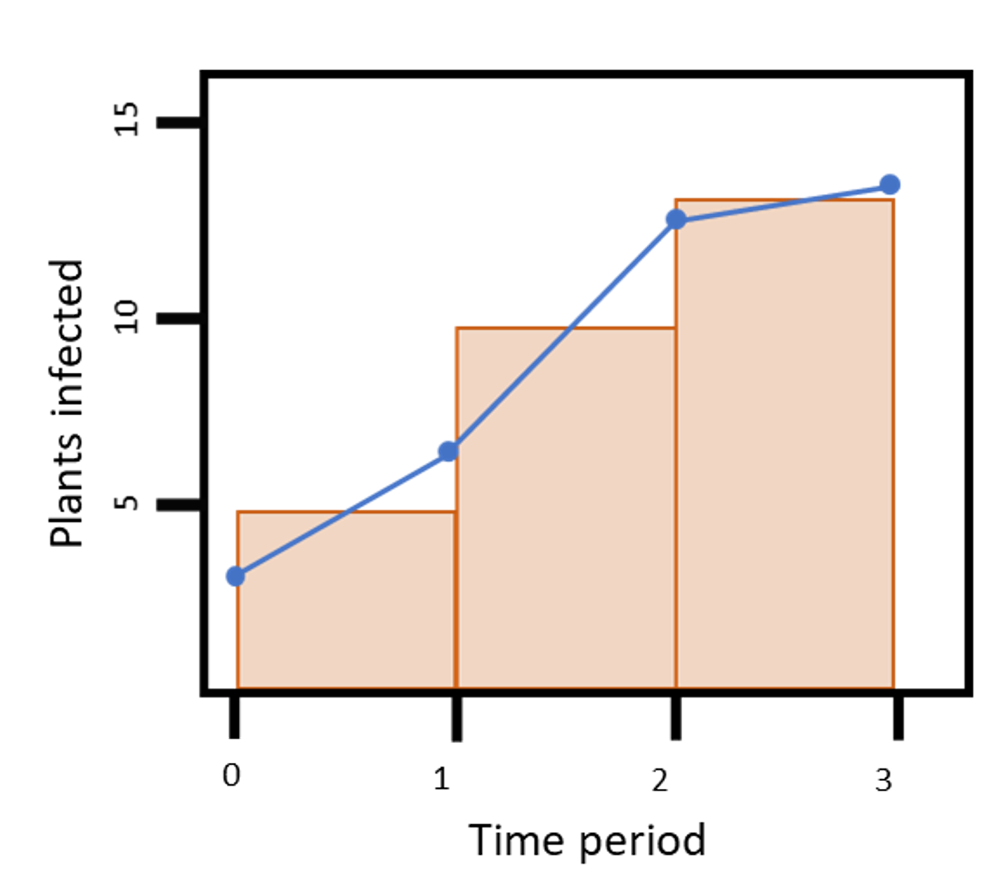

# **Introduction**

Something virtually all researchers of disease are interested in is how epidemics change with time. A valuable concept in the field of plant pathology is the disease progress curve. This chart visualizes how the number of infected individuals changes, and can be used to identify and distinguish between different time periods relevant to the disease. Depending on the values used for the y-axis, the area under the curve can be calculated to provide values describing the severity of infection within a certain time period.

```{r image}



```

In this lesson, we will explore some temporal aspects of plant pathology with basic R coding principles. Along with the disease aspect of this class, you will also learn how to perform other crucial R tasks, such as creating an iterative loop, defining a custom functions, and working with multiple Excel sheets. We’ll also briefly discuss good naming conventions when working in R.

**Extra Resources**

Below we have collected several resources that may help your understanding:
> APS Education center ("https://www.apsnet.org/edcenter/disimpactmngmnt/topc/Pages/default.aspx")
> Campbell, C. Lee, and Laurence V. Madden. 1990. Introduction to Plant Disease Epidemiology. John Wiley & Sons.
> Madden, Laurence V, Gareth Hughes, and Frank Van Den Bosch. 2007. The Study of Plant Disease Epidemics. American > Phytopathological Society St. Paul, MN.
>Epidemiology in R: [Ecology and Epidemiology in R]

Note - if you are a PSU student, you can get many of these books online and for free at the library.

# **Setting up**

Just like in the previous lesson, we will first create a list of the desired packages and pass them to the library() function. Notice how comments are next to several of the packages. This helps a user remember why they need a certain package so that they don’t remove the package later on.

```{r set up}

# List all packages needed
list.of.packages <-
  c(
    "readxl", 
    "tidyverse",
    "gt", # For customizing html table view
    "conflicted",  
    "here", # Helps with the reproducibility across operating systems
    "agricolae" # Functions for agricultural research
  )

# See if any aren't installed yet
new.packages <-
  list.of.packages[!(list.of.packages %in% installed.packages()[, "Package"])]

# If there were any uninstalled packages, install them
if (length(new.packages))
  install.packages(new.packages)

# Load packages
packages_load <-
  lapply(list.of.packages, require, character.only = TRUE)

# Print warning if there is a problem with installing/loading some of packages
if (any(as.numeric(packages_load) == 0)) {
  warning(paste("Package/s: ", paste(list.of.packages[packages_load != TRUE], sep = ", "), "not loaded!"))
} else {
  print("All packages were successfully loaded.")
}

# Clear the environment
rm(list.of.packages, new.packages, packages_load)

# Resolve conflicts between packages
  conflict_prefer("filter", "dplyr")
  conflict_prefer("select", "dplyr")

```

If you have trouble installing or loading packages, please see Lesson 1 - Intro to R.

**Importing the Data**

Researchers often save their data to Excel sheets. Sometimes, this data is partitioned into separate sheets within the same document. We will use the `read_xlsx()` function and the `sheet` argument to tell R to load in the first sheet of our example data.

Data are loaded from the usual “weapon” of agronomists - an excel sheet. In this case, separate sheets are used to store simulated disease data from different years. Initially, data from the first year are loaded. It is also useful to clean up and shorten variable names using basic string manipulation.

```{r read data}

# Read in the data
dta1 <- readxl::read_xlsx(here::here("data/sample_data.xlsx"),
                         sheet = 1,
                         col_types = c('numeric', 'numeric', 'numeric', 'numeric', 'numeric'))

# View the top of the data
head(dta1)

```

The first column, DAI for days after infection, describes the days since the study started. Column ‘New’ lists the number of new cases or newly-infected plants, while the Infected column sums all currently infected plants. Proportion is the amount of the population infected relative to the whole population. Rate describes the average number of new infections per day. In the disease progression curve, DAI will be the x-axis. The y-axis will be the proportion of the population infected. The slope of the line would be determined by the rate of infection.

Using the format package::command() can ensure that you are using the correct command when a conflicting command from another package may be present. This is an alternative to defining conflicts like we did when loading packages.

You should have gotten a warning about the NA value in the data. The warning tells you exactly where it came from - R2C5 (row 2, column 5). This is because R cannot convert the characters “NA” from our data into a number. Instead, it uses the NA symbol. This is a non-character data type that represents missing data. We will get rid of it later.

We will modify dta1 to make it easier to work with, while also exploring naming conventions in R.

### **Naming objects in R**

Notice how we did not name the previously loaded object ‘data’. Instead, we use a shortened version, ‘dta1’. This allows us to reference our data object without accidentally calling any functions that use the word ‘data’. This is a good practice to follow in R to prevent errors.

For now, we want to manipulate the data to make it easier to work with. The column names can be shortened and made to be lower case, and we can replace the NA in row 1, column 5 with a 0 to prevent any errors downstream.

```{r format data}

# Use colnames() to replace column names with a vector of shorter variations
colnames(dta1) <- c("dai", "new", "inf", "prop", "rate")
# Note - dai stands for days after infection

# Use is.na() to replace the NA symbol with a 0
dta1[(is.na(dta1))] <- 0 

```

Just as with naming objects, following certain practices when naming variables is a good idea. Typically, it is a good idea to use short, lower-case names to make it easy to access the column of interest. Establishing a convention for naming similar objects is also important. In our example data, we’ve shortened the names and used the same formatting pattern. We can call individual columns quite easily.

```{r cols}

# Get DAI
# Method 1
dta1$dai

# Method 2
dta1[1]

# Get proportion infected
dta1$prop

# Turn proportion infected into a vector
prop.vec <- dta1$prop

```

With our new column names, we can get our data with fewer keystrokes and without knowing the order of columns. Now we will look at an example with a larger collection of objects to name.

Example 1: Naming conventions

Imagine that you have data for each month of the year. You can name each data object with a number, like what is shown in sheet “A”, or with the name of the month, like in sheet “B”. Both options are fine, but only the last column in either sheet show naming conventions that 1) are likely to be understood in the future, or by another person and 2) have consistent format and length.

```{r naming example}

# Load sheet A
a <- read_xlsx(here::here("data/naming_conventions_example_data.xlsx"),
                         sheet = "A")
a

# Load sheet B
b <- read_xlsx(here::here("data/naming_conventions_example_data.xlsx"),
                         sheet = 2)
b

```

The last column of either sheet A or sheet B is the best naming convention because they’re easily understood and consistently formatted. If you need to revisit a script in several months or years, you will understand that dta11 contains the January data. If you need to modify the names of these objects later on, you can easily do so because they follow the same pattern and have the same length. Remember that object and variable names shouldn’t begin with a number or symbol - this can cause very annoying problems when trying to access them.

You’ve also seen how different sheets within the same Excel document can be accessed with either their name as a character, or with the number of the sheet.

**Managing the Global Environment**

The nice thing about the way we’ve loaded in and named our data and variables is that they are easily accessible and can even be seen in the Global Environment. The bad side of this is that, when data is loaded in and variables are defined, we can accidentally reference them when we don’t mean to. For this reason, it’s important to 1) remove items not in use and 2) be mindful when modifying objects that retain their name. In the first case, unnecessary objects in the Global Environment can be accidentally referenced when you mean to use something else. In the second, a particular operation may fail. If you don’t notice the failure, you could be referencing the older version of that object.

For this reason, we will now remove objects a, b, and prop.vec from the Global Environment using the rm() command. Alternatively, you can switch the view of the Global Environment to Grid and select the objects you want to remove manually.

```{r rm}

# Remove objects a, b, and prop.vec
rm(a, b, prop.vec)

```

**Back to the example data**

We can create a disease progression curve for our example data. Instead of using commands from the package ggplot2, we will use base R commands. Although ggplot2 makes more visually appealing and easily manipulated plots, its functions are subject to more rapid change than base R. This means that code using base R will be more likely to work in the future than code using ggplot2. In fact, most base R commands will have better longevity.

We will plot new and total infections with days after infection (time) as the x-axis, and the proportion of all plants on the y-axis.

```{r plot}

# We start by defining and formatting columns to plot on axes
base::plot(x = dta1$dai, y = dta1$prop, 
           xlab = "Dates after initial infection",
           ylab="Number of infected plants", 
           
           # Plotting the total number of infected plants in black
           type="b", lty=1, pch=19, lwd=3, xlim=c(0,max(dta1$dai)))

# Using points() to add a layer showing the number of new infections
points(dta1$dai, dta1$rate, type = "b", lty = 1, pch = 19, lwd = 3, col = "darkgreen")

# Adding labels to both lines
mtext("Proportion infected", 1.9, at = 40,-7)
mtext("Infection rate", 1.9, at = 70, -4, col = "darkgreen")

```

# **Area under the the disease progress curve (AUDPC)**

Now that we have created a disease progress curve for our data, we can calculate the area under the disease progress curve (AUDPC). This is a simple and common method to summarize epidemics. The AUDPC can be calculated with:

$$ AUDPC = \sum_{i=1}^{n-1} \frac{y_{i}+y_{i+1}}{2} × (t_{i+1} - t_1) $$

where yi
 is an assessment of a disease (severity, proportion infected, etc.) at the ith
 observation, ti
 is time (in days, hours, etc.) at the ith
 observation, and n
 is the total number of observations.

In our case yi
 is the proportion of infected plants (prop), ti
 is a date (dai), and n
 is the total number of plants at a particular point in time (623). The resulting area under the curve could be calculated with more complex geometry, but it’s easier to apply rectangles and calculate their area instead.

To illustrate how this is done, we will work on a smaller subset of our data.

```{r sub plot}

# Select rows 1-4 for the subsetted data
sub.dta1 <- dta1[1:4,]

# Visual the disease progress curve for sub.dta1

# Define the coordinates of the area under the curve
x.coords <- c(sub.dta1$dai, sub.dta1$dai[4], sub.dta1$dai[1])
y.coords <- c(sub.dta1$prop, 0, 0)

# Plot by dai and inf
plot(sub.dta1$dai, sub.dta1$prop,
     type = "b", lty = 1 , pch = 19, lwd = 3,
     xlim = c(6, max(sub.dta1$dai)), ylim = c(0, max(sub.dta1$prop)),
     xlab = "Dates after initial infection",
     ylab="Proportion of infected plants")

# Use a polygon to shade the area under the curve grey
polygon(x.coords, y.coords, col=gray(0.95), border=NA)

# Visualize each time period with orange rectangles, defined by opposite points
rect(sub.dta1$dai[1],0,sub.dta1$dai[2],((sub.dta1$prop[1]+sub.dta1$prop[2])/2),border="orange")
rect(sub.dta1$dai[2],0,sub.dta1$dai[3],((sub.dta1$prop[2]+sub.dta1$prop[3])/2),border="orange")
rect(sub.dta1$dai[3],0,sub.dta1$dai[4],((sub.dta1$prop[3]+sub.dta1$prop[4])/2),border="orange")

```

The AUDPC is the entire light gray shaded area . It is calculated as a sum of areas between each sampling date, represented as the orange rectangles.

**Calculating the area with rectangles**

Let us begin by considering only the first rectangle. The width is the time between the first sampling date and the next sampling date. The height is the average of the proportion infected on those two dates.

```{r rectangles}

# Calculate the area of rectangle 1

# Get the width (time)
w1 <- ((sub.dta1$dai[1+1]) - sub.dta1$dai[1])
w1

# Get the height (the average proportion infected)
h1 <- (sub.dta1$prop[1]+sub.dta1$prop[1+1])/2
h1

# Get the area
a1 <- w1*h1
a1

# This can be done in fewer steps by combining the calculations w1 and h1:
a1 <- ((sub.dta1$dai[1+1]) - sub.dta1$dai[1])*((sub.dta1$prop[1]+sub.dta1$prop[1+1])/2)
a1

```

We could calculate the area for all three rectangles manually, but it would be a good idea to find a way to do it automatically in case we work with more time periods in the future.

### **Loops**
Loops are bits of code that perform functions iteratively. **For loops*** use the `for()` command to define the objects they will work on, and to assign a variable to represent the objects within the loop. The for() portion of a for loop is immediately following by curly brackets (ex. {}) that contain the functions to be performed in each iteration of the loop. Each time the for loop iterates, it will use the next object to perform the same functions.

Because of this structure, the internal part of a for loop (the area within the curly brackets) is necessarily identical. If you want to store your results with unique names, you need to use the representative variable to create that name. It can be helpful to give the newly-formed object a unique name after all other operations are performed to avoid errors. Because operations within the loop are contained, you will need to use the `print()` function to get feedback in your console.

**Back to the example data**

We’re going to illustrate how you can create a simple loop to calculate the areas of all three rectangles below. Our objects are going to be the numbers 1, 2, and 3, for each of our rectangles. They will be represented by the letter ‘i’.

```{r loop}

# Define the objects and their class, supply a stand-in variable with for()
for (i in as.numeric(1:3)){
  
  # Create an intermediate object, 'result', to save the area to. Use i to indicate which rows of data to get values from. 
  result <- ((sub.dta1$dai[i+1]) - sub.dta1$dai[i])*((sub.dta1$prop[i]+sub.dta1$prop[i+1])/2)
  
  # Rename 'result' with a unique name using the assign() function. Use i to create the new object name. 
  assign(paste0("a",i), result)
}

```

We generated areas for all three rectangles very quickly. The results are in objects a1, a2, and a3. We might prefer to have these results in a single vector. We can do that by creating an empty vector, and then adding the results to it inside of the loop.

``` {r loop 2}

# Create an empty numeric vector to save results to
areas <- numeric()

# Run the loop
for (i in as.numeric(1:3)){
  
  result <- ((sub.dta1$dai[i+1]) - sub.dta1$dai[i])*((sub.dta1$prop[i]+sub.dta1$prop[i+1])/2)
  
  # Instead of using assign() to rename the result, just use append() to add it to the vector.
  areas <- append(areas, result)
}

# View the resulting vector
areas

```

Now we could calculate the area of hundreds of rectangles with only a little more effort than it took to calculate one. The for loop can be an incredibly powerful tool when working on large data sets, or doing the same functions over and over.

**Functions**
So far, we’ve used functions from base R and a variety of packages, like ggplot2 and dplyr. Functions can be defined as follows:

> Function: a sequence of program instructions that performs a specific task, packaged as a unit.

While it’s true that there are hundreds of functions available from already-existing R packages, the function you need might not exist yet. Even if it does exist, it might not be worth downloading another package or re-formatting your data to fit that function. For these reasons, it can be helpful to know how to write your own functions.

Both custom and already-existing functions have 3 essential pieces: the name, parameters/arguments, and body.

> The **function name** is how you call or use the function. In the for loop example above, we used the name of the function `append()` to call the function into use. It’s important to use good naming practices to make your functions memorable and prevent any errors.

> The function parameters/arguments are the inputs for the function to work. Some are required, and some are optional. In `append()`, the required arguments are *x*, the vector to be added to, and values are what is to be added. An optional argument, *after*, can be used to tell R exactly where to place the new values in x.

> The **function body** is the code that accomplishes the function’s task(s). When we call a function, the body is hidden.

We can use the function name in R to find out what the function does, what the function’s arguments are, and what it will return. This is called **querying** a function.

``` {r querying}

# Query the function 'append()'
?append()

```

In the page that appeared in the Help panel, you can see a lot of information about the function. Clicking on the ‘Index’ link at the very bottom can also reveal other commands in the same package.

**Back to the example data**

We can build on our example data by creating a function that will calculate the total AUDPC for us, using the loop we created above.

```{r full loop}

# We name the function 'AUDPC' and define its arguments as 'times' and 'proportions'
AUDPC <- function(times, proportions) {
  
  # Create an empty vector to save loop results to. 
  audpc_scores <- c()
  
  # The number of rectangles is 1 to the number of dates surveyed minus 1. 
  rectangles <- 1:c(length(times) - 1)
  
  # Calculate the area for each rectangle
    for (i in as.numeric(rectangles)){
    
    result <- (times[i+1] - times[i])*((proportions[i]+proportions[i+1])/2)
    
    # Append the ith result to audpc_scores
    audpc_scores <- c(audpc_scores, result)
    }
  
  # Define the returned value as the vector of audpc scores
  return(audpc_scores)
  
}

# Use the function AUDPC and name the result 'audpc_scores' for disease severity scores.
sub.audpc <- AUDPC(times = sub.dta1$dai, proportions = sub.dta1$prop)
sub.audpc

```

We’ve now made a function containing a loop that can quickly get disease severity scores within each time period. These scores indicate that the disease was most severe in the third time period. This corresponds to days 20-28. It corresponds to the rate of infection. Let’s get the AUDPC for the full data set.

```{r full data}

# Use AUDPC() on dta1
audpc1 <- AUDPC(times = dta1$dai, proportions = dta1$prop)
audpc1

# Get the total AUDPC
total1 <- sum(audpc1)
total1
```

We have the UADPC, or disease severity, of all time periods in the data. We can see that the disease severity started increasing slightly at the beginning, and then increased more rapidly in the final time periods.

# **Upscaling: Calculations on a bigger data set**

Now we can use our `AUDPC()` function on a bigger data set while we practice the naming conventions we talked about earlier in the lesson. Normally, we would have several disease progress curves, like the one we have been working on.

Let’s load the data on the second sheet of the same Excel file and call it ‘dta2’. We’ll also rename the columns so it’s easier to work with.

``` {r second data}

# Read in the data
dta2 <- readxl::read_xlsx(here::here("data/sample_data.xlsx"),
                         sheet = 2,
                         col_types = c('numeric', 'numeric', 'numeric', 'numeric', 'numeric'))

# Use colnames() to replace column names with a vector of shorter variations
colnames(dta2) <- c("dai", "new", "inf", "prop", "rate")

# View the top of the data
head(dta2) 

```

We’ve just practiced good naming conventions by making dta1 and dta2 clearly distinguishable. We’ve also made our task easier by shortening the column names, while still being able to tell what they represent.

Now we’ll visualize the new data by plotting it next to dta1.

```{r plot dta2}

# Use dta1 to create the first dot line
plot(dta1$dai, dta1$prop,
     type = "b", lty = 1, pch = 19, lwd = 3, 
     
     # Use the full range of days in both dta1 and dta2 with min() and max()
     xlim = c(min(dta1$dai, dta2$dai), max(dta1$dai, dta2$dai)), 
     ylim = c(0, max(dta1$prop, dta2$prop)),
     xlab = "Dates after initial infection",
     ylab = "Proportions of infected plants")

# Add dta2 with points() to get that data in green
points(dta2$dai, dta2$prop, type = "b", lty = 1, pch = 19, lwd = 3, col = "darkgreen")

# Add labels
mtext("dta1", 1.9, at = 80, -12)
mtext("dta2", 1.9, at = 45, -12, col = "darkgreen")

```

We can see that the disease in dta2 infected more quickly, but over a shorter time. We’ll calculate the AUDPC for dta2 during its time period (day 6 to 55) and compare it to the audpc scores we got for dta1, audpc1.

```{r time per}

# Get the AUDPC for each time period
audpc2 <- AUDPC(dta2$dai, dta2$prop)
audpc2

# Get the total AUDPC
total2 <- sum(audpc2)
total2

# Print audpc1 and total1 to compare
audpc1
total1

# To compare the standardized AUDPC (taking into account that the assessment periods were different)
# This approximately tells us something about the daily increase in development based on small rectangles
raudpc2 <- total2/(max(dta2$dai)-min(dta2$dai))
raudpc1 <- total1/(max(dta1$dai)-min(dta1$dai))

print(cbind(total1, raudpc1, total2, raudpc2))
```

The AUDPC for data set 1 was higher than that of data set 2. Does this necessarily mean that dta1 was a more ‘severe’ disease than dta2? Under which circumstances would the answer be yes, or no?

**Challenge:** What are the pros and cons of the AUDPC approach, and when is it appropriate?

While the AUDPC method can be helpful, there are many other approaches that can be used when AUDPC isn’t appropriate, or to complement the AUDPC approach. We’ll learn more about those in the next lesson.

