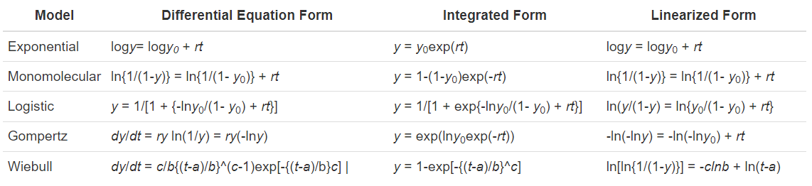

```{r setup, include=FALSE}
knitr::opts_chunk$set(echo = TRUE, warning = FALSE)
```


# **Introduction**

In this lesson, we are going to use the same example data as in Lesson 4 - Temporal Disease Progression 2 to explore several techniques of modelling and plotting disease progression over time, and to learn another fundamental set of fundamental R tools. These tools are the `if`, `if else`, and `else` statements, and are used for 'if else' statements.

After illustrating the use of if else statements in manipulating our R session, we will learn about linear regression. Linear regression is a method of plotting a response variable in a straight line. We'll address the conditions needed for using this technique and see how to evaluate how well the resulting linear model fits the data. 

Then we'll explore several different methods of nonlinear regression. This is a type of modeling that can be used when the response variable doesn't have a linear trajectory. Just like with linear regression, we'll talk about the assumptions and methods of evaluation for these kinds of methods too. 


# **Getting started**

We will load in all of the necessary packages. Some packages may be unfamiliar, so there are comments next to them explaining why we need them. Labeling packages like this can be helpful for remembering why we need certain packages, or why we might not need them if we adapt the script for some other purpose. 

While you're looking at the notes left for many of the packages, think about why commenting on your code is helpful. What kind of comments could help you understand this lesson, or your own R project, in the future? How could your comments help another person understand what you've done? Commenting to explain your code is a crucial part of ensuring your work is reproducible.


```{r libs, message=FALSE, warning=FALSE}

# We'll create the list of needed packages 
list.of.packages <-
  c("tidyverse",
    "rmarkdown",
    "gt", # package for customizing html table view
    "DT", # similar as above
    "kableExtra", # Another package for html table customization
    "rcompanion", # Useful tool for summarizing model outputs and several other modeling related tasks
    "conflicted", #Some functions are named the same way across different packages and they can be conflicts and this package helps sorting this problem 
    "here", #helps with the reproducibility across operating systems
    "ggResidpanel", # Diagnostic plots for several models
    "shiny", # Package for visualization 
    "shinythemes",
    "shinydashboard",
    "shinyscreenshot", #capture screenshots
    "minpack.lm", # Fitting non-linear models
    "deSolve" # Solvers for Initial Value Problems of Differential Equations
  )

# Check for any packages that haven't been downloaded yet
new.packages <-
  list.of.packages[!(list.of.packages %in% installed.packages()[, "Package"])]

# Download packages that are not already present in the library
if (length(new.packages))
  install.packages(new.packages)

# Load packages
packages_load <-
  lapply(list.of.packages, require, character.only = TRUE)

#Print warning if there is a problem with installing/loading some of packages
if (any(as.numeric(packages_load) == 0)) {
  warning(paste("Package/s: ", paste(list.of.packages[packages_load != TRUE], sep = ", "), "not loaded!"))
} else {
  print("All packages were successfully loaded.")
}

# And clear the various package-related objects from the Global Environment
rm(list.of.packages, new.packages, packages_load)

#Resolve conflicts between identical functions from different packages
  conflict_prefer("filter", "dplyr")
  conflict_prefer("select", "dplyr")
  
  
```

If you have trouble downloading or installing any of these packages, please see Lesson 1 - Intro to R for troubleshooting. 

# **R techniques**

### **Directing to a website**

You can direct R to open webpages with the `browseURL()` command from base R. 

```{r browseURL}

# Open the tidyverse home page in a browser window
browseURL("https://www.tidyverse.org/")

```

`browseURL()` can also be used for a quick Google search. We'll use `paste0()`, or paste without separation, to get R to search whatever we would like. 

```{r browse google}

# Define a question/query
my_q <- "What is a linear model?"

# Add the question to the URL
browseURL(paste0('https://www.google.co.in/search?q=', my_q))

```

### **The if else statement**

What if you need to sort the values in your data, perhaps by their quantitative value, or by whether they contain a particular word? 'If else' statements can be used to check if a given values meets a specific condition. The most basic form of this kind of a statement only uses the `if` statement. If the value in question meets a certain condition, then the next line(s) of code happen. We're going  to illustrate how we can get R to add 10 *only* to values above 50.

```{r if}

# Create some data to work on
b <- c(48, 21, 51, 80)

# We'll combine 'if' and a 'for' loop to add 10 to values above 50. 
for (i in b){
  if (i > 50){
    print(i+10)
  }
}

```


It gets more complex when `else` is added. If you want to perform Operation A on values that do meet the condition, and Operation B on values that *don't* meet the condition, you would use `if` and `else`. We're going to get R to add 10 to values above 50, and subtract 10 from values below 50. 

```{r if_else}

for (i in b){
  if (i > 50){
    print(i+10)
  } else {
    print(i - 10)
  }
}

```

R added 10 to every value above 50, and subtracted 10 from every value that wasn't above 50. But what if you have several conditions you need to sort by? For example, what if you want to apply Operation A to values above 50, Operation B to values below 30, and Operation C to any other values? That is when you use a combination of `if`, `else if`, and `else` statements. 

``` {r if_else_combo} 

for (i in b){
  
  # Add 10 to values above 50
  if (i > 50){
    print(i + 10)
  } else if (i < 30) {
    # Subtract 10 from values below 30
    print(i - 10)
  } else {
    # Do nothing to values between 30 and 50
    print(i)
  }
}


```

The next example will show how you can apply this kind of technique to values containing certain character patterns. In this example, we'll use `if`, `else if`, and `else` to sort for insects containing 'fly', 'bug', or neither. We will also the command `grepl()`, which XXX. 

```{r character if}

# Create the example data
insects <- c("butterfly",
             "ant",
             "ladybug",
             "caterpillar",
             "firefly",
             "dragonfly",
             "assassin bug")

# Create empty lists for all 3 categories of insects
fly <- c()
bug <- c()
other <- c()

# For every item in insects
for (i in insects){
  
  # If it contains 'fly'
  if (grepl("fly", i)){
    
    # Add it to the fly list
    fly <- c(fly, i)
    
    # If it instead contains 'bug'
  } else if (grepl("bug", i)){
    
    # Add it to the bug list
    bug <- c(bug, i)
    
    # If it doesn't contain 'fly' or 'bug'
  } else {
    
    # Add it to the other list
    other <- c(other, i)
  }
}

# View the results
fly
bug
other

```

There is also the function `ifelse()`. We use it by providing the condition, what to do if the condition is met, and what to do if it isn't. You can use it on a vector, like the column of a data frame, instead of inside a loop as well. 


```{r ifelse func}

for (i in b){
  ifelse(i == 80,
       print(80),
       print("Not equal to 80"))
}

```


You now should know how to use an 'if else' statement in R. There are many ways to modify these statements to suit your needs that we can't cover. These include sorting objects by multiple conditions. You should keep them in mind as a powerful and simple tool for data manipulation.  

We'll use simple if else statements again later in the lesson. We'll also use the %>% pipe from the dplyr package to write more succinct and readable code.  As always, we'll be commenting on our code using the '#' so this lesson can make sense in the future. 

# **Linear regression**

Linear regression (creating a linear model) is a method used to predict a quantitative response variable's relationship to a predictor variable. The general formula for this is as follows: 

$$
Y_i = \beta_0 + \beta_1 X_i + \epsilon_i
$$

Linear regression is the simplest form of regression, but it forms a basis for other types. The basics of applying a linear regression include checking assumptions necessary to ensure the validity of the method, actually creating the model, and checking the goodness of fit of the model. 


### **Assumptions of linear regression**

In a linear model, it is assumed that:

> The relationship between the response and independent variable is linear. We can check this by plotting the response and independent variables, and by checking the variance of the residuals. 

> The variance among observed points is roughly equivalent. We can check this with a variety of methods, including creating a residuals plot and a Q-Q plot. 

> The observations are independent from each other. We can ensure that with our experimental design. 

**Residuals** are a measure of how close an observed value is to the model's predicted value. 


### **Importing the data** 

This lesson will use the sample example data as was used in Lesson 4 - Temporal disease progression part 1. First, we'll fit a linear model to the time and disease variables for a single year of data. 

```{r get_data}
# Read the example data and name it full_dta
full_dta <- 
  readRDS(file = here::here( "data/test_data.rds")) 

# To create dta, take full_dta
dta <- full_dta %>% 
  
  # And filter for year one only
  filter(yr == 1)%>% 
  
  # And keep columns dai and prop
  select(dai, prop)

```

Notice how we use a pipe (%>%) to perform multiple manipulations of a data frame. This can make code easier to understand. If you are still confused about the use of pipes in code, try reading the code as a sentence. For instance "To make dta, take full_dta, then filter for year one, and then select dai and prop columns". 


### **Fitting the model**

We can use the `lm()` function to have R fit a model to the data. The `lm()` function requires you to name the response and independent variables in that order, separated by a tilde symbol ('~', pronounced 'tilda'). The second requirement is the data itself. 

```{r fit_model}

# Create the linear model ('lmod') with prop as the response variable, dai as the independent variable, and dta as the data set. 
lmod <- lm(prop~dai, data = dta)

```

After rounding to two decimal points, the estimated regression equation can be written as follows \$ prop= -0.21 + 0.01dai\$. Check your understanding by answering the following questions: 

> What does the y-intercept mean? Why is it negative? 

> How should we interpret the slope? 

> Does this model provide any valuable information about our system of study? What questions can it address? 

Now we'll look at key features of the model. 

```{r}

# Summarize key features of lmod
summary(lmod)

# Alternatively, use str(lmod) to see key features

```

We get four fundamental values. They can be understood as follows: 

> The residual standard error (RSE) is a measure of the standard variance in residuals, or how closely values fit the model. A smaller number indicates a better result. 

> R^2^ is a measure of the amount of variance in the response variable that can be explained by the independent variable. A larger number means that our model explains more variance in the response variable, indicating a stronger model. 

> The R^2^ adjusted is related to R^2^, but it is dependent on the number of explanatory variables used in the model. It can be equivalent to R^2^, but it is never greater.  

> The final variable of interest if the F-statistic. This is related to the p-value and shows how added variables improved the model. To determine if the added variables or coefficients helped, you'll need to look at the p-value and an f-table. 

To test your understanding, please address the following questions:

> Why can the adjusted R^2^ value not be greater than the R^2^ value? 

> Why would adding more explanatory variables negatively impact the R^2^ value? 

> What attributes of the data impact the F-statistic? 

> When could an added explanatory variable not improve the model? 


### **Model diagnostics**

Now we can check that the assumptions for applying a linear regression have been fulfilled. Namely, we can check that the variance of the residuals is approximately equivalent throughout the x-axis. If this isn't the case, a linear model may not be appropriate for this data. 

The residual variance can be calculated with the following equation: 

Residual variance = sum((observed value - predicted value)^2^)/(n - p - 1)

Where the square of the difference between the observed value and the predicted value is summed and then divided. n is the number of data points and p is the number of parameters in the model. In our example, n = 13, and p = 1 (time or `dai`.

R can calculate the residual variance quickly, and plot it in a variety of ways. Below, we'll create some of the more common diagnostic figures you can create with base R's `plot()` function. Each of these addresses the variability in the model's residuals in a different way by including the `which` argument. 

```{r diag_plots_lin, figures-side, fig.show="hold", out.width="50%"}

# A plot of residuals vs. fitted values
plot(lmod, which=1)

# A normal Q-Q plot
plot(lmod, which=2)

# A scale-location plot of sqrt(residuals) vs. fitted values 
plot(lmod, which=3)

# Cook's distances vs. row labels (i.e., row 1, row 2, row 3, etc.)/number of observations (i.e., 1, 2, 3, etc.)
plot(lmod, which=4)

```

A more visually appealing presentation can be created with package `ggresidpanel`:

```{r diag_plot_two, cache=TRUE}

# Create all relevant plots 
resid_panel(lmod, qqbands = TRUE, plots = "all")

# Optional - learn more about the ggresidpanel by visiting their webpage with the following command:
# browseURL("https://goodekat.github.io/ggResidpanel/")

```

We can also get more information about the `resid_panel()` command by placing our cursor somewhere within the word and pressing 'F1'. 

**Some questions**: 
> What is represented in each figure above? 
> How does it provide information on the goodness of fit of our model? 
> Do you see any problems with the goodness of fit? 

**Comparing observed values to predicted**

We can better visualize some of the issues with this fit by plotting the observed values from the data, and comparing them to the line created in the model. We first need to calculate the predicted values. We'll use the `predict()` command to do so, and store the predicted values in dta under the column name 'pred' (for predicted).  

```{r obs vs pred}

# Calculate the predicted values with predict()
dta[,"pred"] <- predict(object = lmod, newdata = dta[,"dai"])

# Display dta as a table with gt::gt()
gt::gt(dta)

```

**Challenge**: Why was `dta[ , "dai"]` used? Can `dta$dai` be used? (Hint:`predict()` and  F1)  

To visualize the differences between the observed and predicted values, we'll want to transform our data to have a single column for x and for y, and to have predicted or observed as a variable to color points by. To do this, we'll 'melt' the data into a long format. Basically, we'll reduce the number of columns and add more rows. 


```{r pivot longer}

# Create dta_long by 
dta_long <- 
  
  # Concatenating columns prop and pre
dta %>% 
  pivot_longer(cols = c("prop", "pred"),
               
               # And turning these column names into values in column 'origin'
               names_to = "origin",
               
               # And putting their values in column 'prop'
               values_to = "prop"
               )

```

**Challenge**: Add comments after each argument of the function `pivot_longer()` which explain what each line accomplishes. 

Finally, the data is  ready for visualization.

```{r lin_fit_plot, cache=TRUE}

# Use dta_long to create a plot with x = dai, y = proportion of disease, and 
# color = predicted or observed. 
ggplot(dta_long, aes(dai, prop, color = origin)) +
  geom_point(size = 2) +
  geom_line(linetype = "dashed") +
  theme_bw() +
  
  # Place the legend inside the graph to save space
  theme(legend.position = c(0.75, 0.15)) + #legend into a plotting area
  
  # Format the y axis
  scale_y_continuous(
    breaks = seq(0, 1, 0.2),
    name = "Disease"
  ) +
  
  # Format the x axis 
  scale_x_continuous(
    expand = c(0, 0),
    breaks = seq(0, 80, 20),
    name = "Time") 

```

**Question:** Identify the areas where the model does not fit as well. 
> Why do they occur where they do? 
> Does that mean that representing the data with this model is inappropriate? 


**Conclusion**

In statistical terms the linear model does a good job in describing the trend in data in this case. In practical terms, this means that the model told us that the level of disease is growing over time, hence there is a positive relationship between time and the level of disease. The kind of information generated in the creation of the linear model, the slope, y-intercept, and the residual variances are **descriptive statistics**. These values help us understand the relationship between the proportion of disease and time. They can be used to infer the similarities and differences between the disease case in the example data, and another system. This is called **inferential statistics**. 

The linear model does a good job, but it could be better. For many instances in the study of plant disease, a more complex model is necessary. 


# **Using growth models to explore temporal disease progress**


Many of the complex models often used in plant pathology are **growth models**. They take many different forms, and typically are more difficult to calculate by hand. When you look at the table below, you'll see that each of the featured growth models' characteristics represented in different forms.


``` {r growth models}




```

*y0* is the population at time = 0 and *r* is the rate of growth. 

The columns 'Differential' and 'Linear' describe different aspects of the formula. The differential form of each model describes the rate of change, while the linear form describes how x compares to y. The full model is in the 'Integrated' column. 

Of all these models, Exponential and Logistic are the most simple. 

**Exponential:** In exponential growth, the growth rate is proportional to the size of the population. This results in exponential growth. In biological systems, the rate equation is deterministic, resulting from biological factors like the intrinsic reproduction rate. 

**Logistic:** In the logistic model, the growth of the population is constrained, reflecting the idea that growth is limited. There is a maximum population size, or a bound on the maximum disease intensity (100%). 

Literature about this population limit was first introduced in the late 1800's by Thomas Malthus, an English clergyman. Inspired by Charles Darwin's recent work on the theory of natural selection, Malthus wrote about limits on the human population. He and others observed that species populations initially grow rapidly in the presence of abundant resources. As the population grows, it depletes its resources, resulting in slower growth and increased competition among members of the population. Logistic growth models reflect this reality of limited resources. 

Because the population growth is limited by different variables at different times, the rate of growth changes. The different variables that can impact population growth, such as resource availability, disease, space, etc., resulted in the need for modified versions of logistic growth. 

One of these variations is the Gompertz curve, named after Benjamin Gompertz (1779--1865). This model results in a sigmoidal curve where growth is slower at the beginnings and ends of a population's development. Think of how a disease enters a field and grows. At first, its transmission is limited because it has few host plants, and its population is small. As the proportion of infected plants increases, the disease can infect more plants. As the disease infects more and more of the plants, fewer new plants are available to serve as hosts, meaning that the growth rate must reduce. 

The Wiebull growth model is logistic, and is comparable to the Gompertz formula in many ways. Both models treat aging and mortality differently, but the fundamental cap on population size is present. 

The monomolecular model has been used to described several phenomena in chemistry (hence the name) and biology (plant growth etc.). It is also called the negative exponential or restricted exponential model, as its rate is constantly decreasing. In plant pathology, it is often used to describe monocyclic epidemics.  

The monomolecular model has been used to describe phenomenon in chemistry (hence the name) and biology. It can be called 'the negative exponential' or 'restricted exponential model' because the rate of growth is always decreasing. It can be used to describe mono-cyclic epidemics, or epidemics that only occur once per crop cycle. 

We can use the following app to see how each of these models reacts to different parameters. If you're having trouble seeing the app, try re-loading the page. 

```{r}
knitr::include_app("https://mladen-cucak.shinyapps.io/temp_prog/",
 height = "800px")
```


We can do this ourselves with our example data. We'll prepare by manipulating the data with `ifelse()`, and then removing some of the things we did in the linear model section. 

```{r}

# Create a new dta by transforming the old dta
dta <- dta %>%
  # If prop is equal to 1, take away .0001. If not, just keep the original value. 
  mutate(prop = ifelse(prop == 1, 
                       prop - .0001, 
                       prop) 
         )

# Keep only columns dai and prop
dta <- dta[,c("dai", "prop")]

# Note that we could have instead written this:
# dta <- dta[,-"pred"]

```

To adhere to each model, we need to transform the response variable and refit a linear model, according to their requirements.

```{r}

# For exponential growth
exp_mod<-lm(log(prop)~dai, data = dta) # Exponential = log(y)

# Logistic
log_mod<-lm(log(prop/(1-prop))~dai, data = dta) 

# Gompertz
gom_mod<-lm(-log(-log(prop))~dai, data = dta) 

# Fit a linear model for the monomolecular growth formula
mon_mod<-lm(log(1/(1-prop))~dai, data = dta)

```

We'll save the results of each model into list 'models' and label them. 

```{r}

# Create the list
models <- list(mon_mod, exp_mod,log_mod, gom_mod)

# Label the individual elements/models in the list
names(models) <-  c("Exponential", "Logistic", "Gompertz", "Monomolecular")

# Inspect one of the elements to see what is inside and how it is formatted
summary(exp_mod)

```

Function `compareLM()` from package 'rcompanion' can be used to get a table of each model's statistics. Because it doesn't automatically include the F-statistics, we need to get those numbers first. We can use `sapply()` to apply operations to the list, and it will return a vector with the F-statistics for each model. 

```{r diag_table,cache=TRUE}

# Get a vector of the model's F-stats, rounded to two decimal places. 
f_stat <- 
sapply(models, function(x) summary(x)$fstatistic[1] %>% as.numeric %>% round(2))

# Use the compareLM() function from package 'rcompanion' to get a statistical summary of each model from the list. 
rcompanion::compareLM(mon_mod, exp_mod,log_mod, gom_mod)[[2]] %>%
  
  # Modify the table by adding the name of each model before the data columns
  add_column(Model = names(models),
              .before = 1) %>% 
  
  # Add the F-statistics before the p-value. 
  add_column(., F_statistic = f_stat, .before = "p.value") %>% 
  
  # Rename the column titles to better fit on the page
  rename("No. of Parameters" = Rank,
         "DF" = "Df.res",
         "R sq." = "R.squared",
         "Adj. R sq." = "Adj.R.sq",
         "F" = "F_statistic",
         "p" = "p.value",
         "Shapiro-Wilk" = "Shapiro.W",
         "Shapiro-Wilk p" = "Shapiro.p") %>% 
  
  # Remove AICc and BIC from the summary
  select(-c("AICc", "BIC")) %>% 
  
  # Print the table as an html
  kable(format = "html") %>%
  
  # Give the table stripes between the rows
  kableExtra::kable_styling(latex_options = "striped", full_width = FALSE) 
```

**Questions:**

> Which of these models looks strongest? Best-fitted? 

> How would you interpret the F-statistics? 

Now we'll get predicted values of each model for every point in dta. This will allow us to plot the models and the observed data like we did in the Linear section. 

```{r}

# For every model in the models list
for(i in seq(models)){ 
  
  # Make a variable with the model name 
  model_name <- names(models[i]) 
  
  # Calculate predictions for that model and save them in a new column
  dta[ , model_name] <- 
    predict(object= models[[i]], 
            newdata=dta[ , "dai"])

}

# Let's check out our predicted values 
gt::gt(head(dta, 5)) # Show the first five rows
```

Now remember that we transformed the proportion of disease to create our models. Let's account for that by back-transforming them so they match their original values. 

```{r}

# For exponential, logistic, Gompertz, and monomolecular
dta$Exponential <- exp(dta$Exponential)
dta$Logistic <- 1/(1+exp(-dta$Logistic))
dta$Gompertz <- exp(-exp(-dta$Gompertz))
dta$Monomolecular <-  1 - exp(-dta$Monomolecular)

```

### **Visualize predicted versus observed values**

We'll transform our data structure to be long, just as we did in the Linear section. This will make it easy to plot each model's values in a different color. 

```{r lin_fits_plot, out.width="100%", out.height=550}

# Create a vector including all column names except dai and prop
vars_to_long <- colnames(dta)[!colnames(dta) %in% c("dai", "prop")]

# Create dta_long by
dta_long <- 
dta %>% 
    
    # Concating the values in those columns
    pivot_longer(cols = vars_to_long,
                 
                 # Putting the column names in column 'origin'
                 names_to = "origin",
                 
                 # And putting their values in 'fits'
                 values_to = "fits"
    )

# Take dta_long and plot it
# Challenge: Can you interpret what each line means? Use a # to leave an explanation above each line. 
dta_long %>% 
ggplot()+
  geom_point(aes(dai, prop),size = 1, shape = 1) +
  geom_line(aes(dai, prop),linetype = "solid")+
  geom_point(aes(dai, fits),size = 1, shape = 2) +
  geom_line(aes(dai, fits, color = origin),linetype = "dashed")+

  theme_bw()+
  scale_y_continuous(limits = c(0, 1),
                     expand = c(c(-.05, 1.05)),
                     breaks = seq(0, 1, 0.2),
                     name = "Disease") +
  scale_x_continuous(expand = c(0, 0),
                     breaks = seq(0, 80, 20),
                     name = "Time")+
  facet_wrap(~origin, ncol = 2)+
  ylim(-0.2,1.2) +
  theme(legend.position = "none") 

```

**Questions**:

> Where does each model fit the data best? Why?
> Where is the fit the poorest for each model? Why? 

# **Nonlinear regression**

Nonlinear regression is necessary when the relationship between the independent and response variable(s) is non-linear. This can occur simply because the relationship between the response variable and a single independent variable is nonlinear. It can also occur when multiple variables, each with a linear relationship to the response variable, have an overall relationship that can't be expressed as linear. 

Nonlinear regression can be tricky because there isn't a closed-form expression to describe the parameters. While simple linear regression can be expressed in some form of the below formula, nonlinear models cannot. 

Linear model:
$$
Y_i = \beta_0 + \beta_1 X_i + \epsilon_i
$$
Because of this, it can be hard to define important parameters necessary to create a model. 

In these cases, we can use functions like `nls()` or Nonlinear Least Squares, from base R. Fundamentally, we are creating and evaluating an assortment of models, using different parameters until we find the best one. The idea is that we don't transform the data so that we are not bound by more assumptions. 


There are different methods to define initial starting parameters:

> Method 1: Use a grid search approach to find the best combination of all parameters

> Method 2: Do a preliminary analysis to estimate parameters. This preliminary analysis can be performed on data similar to your situation. 

> Method 3: Estimating parameters based on what is known about the system. 

> Method 4: Using a genetic algorithm. Learn more about genetic algorithms here: <https://en.wikipedia.org/wiki/Genetic_algorithm>

> Method 5: Use one of a variety of R functions, like nls(), to test multiple models until convergence (agreement) between the best of them is reached. 

### **Fit models**

We'll use `nls()` to create a function that tests formulas against our test data, starting with parameters y0 = 0.001 and r = 0.05. Starting with minimum start values can save you computational time by not running models that can't fit. Because trace = TRUE, the model will be estimated iteratively, and its fit will be evaluated with the example data. 

```{r}

# Name the function and its required inputs
FitMod <-function(mod, data){
  
  # Define the operation of the function and which input goes where
    nls(mod,
      start = list(y0 = 0.001, rate = 0.05),
      trace = TRUE,
      data = dta)
}

```

Define formulas to test with `FitMod()`. 

```{r }

# Define formulas
exp_formula <-  formula(prop ~ y0 * exp(rate*dai))
log_formula <-  formula(prop ~ 1/(1+exp(-(log(y0/(1-y0))+rate*dai))))
gom_formula <-  formula(prop ~ exp(log(y0)*exp(-rate*dai)))
mon_formula <-  formula(prop ~ 1-((1-y0)*exp(-rate*dai)))
```

Run `FitMod()` with each of the formulas. 

```{r fitting_nlm, eval=FALSE}

# Use the defined formulas as the mod input to FitMod()
exp_mod <-  FitMod(exp_formula, dta)
log_mod <-  FitMod(log_formula, dta)
gom_mod <-  FitMod(gom_formula, dta)
mon_mod <-  FitMod(mon_formula, dta)

```

You probably noticed that R provided feedback when fitting the Gompertz model to our data. This convergence failure can occur when we need to provide more data or when we need to use a different algorithm. 

We can use `minpack.lm::nlsLM()` to explore further modifications of the Levenberg-Marquardt algorithm, the algorithm used for nonlinear least squares, with the Gompertz model. With this function, you can define upper and lower boundaries, again reducing the computational time necessary by eliminating possible models. We use the `control` argument to determine the number of iterations. 


```{r}

# Create gom_mod with the Gompertz formula inside function nlsLM()
gom_mod <- 
minpack.lm::nlsLM(prop ~ exp(log(y0)*exp(-rate*dai)),
      start=list(y0=0.001, rate=0.05),
      control = list(maxiter = 2000, maxfev = 5000),
      upper = c(.2, .2),
      lower = c(1e-8, .0001),
      data = dta)

```

Similar to the linear modeling exercise, model fits can be saved into a list. Each element of the list is named according to the population growth model used.

```{r}

# Create list 'models' with mon_mon, exp_mod, etc. as elements
models <- list(mon_mod, exp_mod, log_mod, gom_mod)

# Name the elements of the list appropriately
names(models) <-  c("Monomolecular", "Exponential", "Logistic", "Gompertz")

```

We can estimate the goodness of fit of the resulting models with the **pseudo R^2^** value. This is an estimate of the R^2^ value we've seen before. Since it isn't possible to calculate a single R^2^ value, we use the approximation instead to determine goodness of fit instead. 

We will write a function to calculate it. 

```{r}

# In function PseudoRsq, you input model and disease
PseudoRsq <- function(model, disease) {
  
  # You calculate the R2/sum of the residuals squared of the linear model
  RSS.1 <- sum(residuals(model)^2)
  
  # The R2 of the observed vs. predicted disease
  TSS.1 <- sum((disease - mean(disease))^2)
  
  # And subtract that proportion from 1
  (1 - (RSS.1 / TSS.1))
}
```

Now we'll calculate the expected values for each model, as well as a pseudo R^2^.

```{r}

# Create a dataframe with columns 'models' and 'r_sq' to save the pseudo R^2 results to.
fit_diag <- data.frame(models = names(models), r_sq = rep(NA, length(models)))

# For each model
for(i in seq(models)){

  # Make a variable with the model name
  model_name <- names(models[i])

  # Calculate predictions for that model and save them in a new column
  dta[, model_name] <-
    predict(object= models[[i]],
            newdata=dta[, "dai"])

  fit_diag[ fit_diag$models == model_name, "r_sq"] <-
    PseudoRsq(models[[i]], dta$prop)

}

# Show the first five predicted values for each model
gt::gt(head(dta, 5)) # Show the first five rows

# Show the pseudo R^2 value for each model. 
gt::gt(fit_diag)

```

This code is very similar to the previous one presented earlier. The only major difference is that the model fit diagnostics are joined to the data and plotted as a text label. 

### **Visualize fits**


Now we will visualize the fit of each of our nonlinear models. Just like the previous two times, we need to transform our data structure. 

```{r nlm_fits_plot, out.width="100%", out.height=550, warning=FALSE}

# Create a vector of columns to remove
vars_to_long <- colnames(dta)[!colnames(dta) %in% c("dai", "prop")]

# Create dta_long by taking dta and 
dta_long <-
dta %>%
    
    # Concatenating the values from columns we don't want
    pivot_longer(cols = vars_to_long,
                 
                 # Putting the column names in column 'models' as values
                 names_to = "models",
                 
                 # And putting the values in column 'fits
                 values_to = "fits"
    ) %>%
  # and joining it to the model_diag (the object with model names and pseudo R^2 values)
  left_join(., fit_diag, by = "models") 

# Take dta_long
 dta_long %>%
   
   # Plot it
ggplot()+
  geom_point(aes(dai, prop),size = 1, shape = 1) +
  geom_line(aes(dai, prop),linetype = "solid")+
  geom_point(aes(dai, fits),size = 1, shape = 2) +
  geom_line(aes(dai, fits, color = models),linetype = "dashed")+
  # Add labels for model fit diag.
  geom_text(aes( label = paste("R^2: ", round(r_sq,2),sep="")),parse=T,x=20,y=.8)+
  theme_bw()+
  facet_wrap(~models, ncol = 2)+
  scale_y_continuous(limits = c(0, 1),
                     expand = c(0, 0),
                     breaks = seq(0, 1, 0.2),
                     name = "Disease") +
  scale_x_continuous(expand = c(0, 0),
                     breaks = seq(0, 80, 20),
                     name = "Time")+
  theme(legend.position = "none")
```

Now we've seen several additional ways to model disease progression and discussed their suitability. Additionally, we have learned valuable R tools such as if else statements that can help us manipulate data.